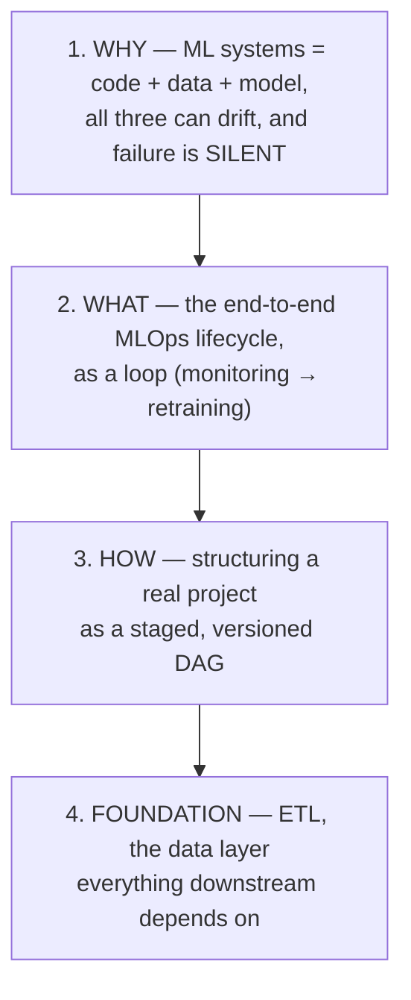

# ⚙️ 100 Days of MLOps — Lesson Notes

> One-page study notes distilled from the **CampusX "100 Days of MLOps" playlist** ([full playlist](https://www.youtube.com/playlist?list=PLKnIA16_RmvaKHYjy5v0dJh8edeaEWb-b)) — 4 videos, from "why MLOps" to a real data pipeline.
> Each page pairs the video's own framing with a substantially expanded glossary and explanation of the surrounding MLOps practice, so the notes work as standalone study material.

---

## Lessons

| # | Lesson | Length | Theme | Source | Status |
|---|--------|:------:|:------|--------|:------:|
| 1 | [Why Should You Learn MLOps? (Software vs. ML Systems)](01-why-learn-mlops.md) | 38:59 | Motivation | [video](https://www.youtube.com/watch?v=H4fZ3HFv684&list=PLKnIA16_RmvaKHYjy5v0dJh8edeaEWb-b&index=1) | ✅ |
| 2 | [What is MLOps? (End-to-End Example)](02-what-is-mlops.md) | 1:00:41 | Lifecycle map | [video](https://www.youtube.com/watch?v=6SRifO6dmuE&list=PLKnIA16_RmvaKHYjy5v0dJh8edeaEWb-b&index=2) | ✅ |
| 3 | [Building an ML Project Using MLOps](03-building-an-ml-project-with-mlops.md) | 1:21:11 | Hands-on structure | [video](https://www.youtube.com/watch?v=eCjuoqUy8Is&list=PLKnIA16_RmvaKHYjy5v0dJh8edeaEWb-b&index=3) | ✅ |
| 4 | [ETL Pipeline in MLOps (Data Management)](04-etl-pipeline-in-mlops.md) | 32:46 | Data foundation | [video](https://www.youtube.com/watch?v=D_-qy1A76EM&list=PLKnIA16_RmvaKHYjy5v0dJh8edeaEWb-b&index=4) | ✅ |

**Playlist complete — all 4 lessons. 🎉**

---

## The arc (how the lessons connect)

- **Lesson 1** = the **motivation** — why MLOps is genuinely distinct from DevOps (three artifacts, silent failure, Continuous Training).
- **Lesson 2** = the **map** — the full lifecycle as a loop, plus deployment patterns and the three monitoring layers.
- **Lesson 3** = the **build** — turning that map into a stage-separated, testable project structure.
- **Lesson 4** = the **foundation** — the ETL/ELT data layer, validation, versioning, and leakage hazards.

---

## Core cheat-sheet

| Concept | In one line |
|---------|-------------|
| **ML system = code + data + model** | Three independently-versionable, independently-failing components, vs. software's "code only" |
| **Silent failure** | The service returns 200 OK with valid-looking predictions that are increasingly wrong — every traditional monitor stays green |
| **Data drift (covariate shift)** | Input distribution `P(X)` moves; the input→output relationship holds |
| **Concept drift** | The relationship `P(Y\|X)` itself moves — the right answer for the same input changed |
| **Training-serving skew** | The same feature computed differently in training vs. serving |
| **Data leakage** | Training-time info unavailable at prediction time — spectacular offline metrics, production collapse |
| **Point-in-time correctness** | Each historical row's features reflect only what was knowable at that moment |
| **CT (Continuous Training)** | Automated retraining on drift/schedule/new data — the practice DevOps has no equivalent for |
| **MLOps maturity 0/1/2** | Manual → automated training pipeline → full CI/CD/CT automation |
| **Four artifacts to version** | Code, data, model, environment+config — all four, or reproducibility is impossible |
| **MLOps lifecycle** | Ingest → validate → features → train → evaluate → register → deploy → monitor → **retrain** |
| **Model registry** | Versioned model catalog with lifecycle stages (Staging → Production → Archived) |
| **Validation gate** | An automated threshold (absolute, vs-champion, per-segment) a model must clear to ship |
| **Deployment patterns** | Shadow · canary · blue-green · A/B · champion/challenger |
| **Three monitoring layers** | Operational (latency/errors) · data quality (schema/distributions) · model quality (accuracy/calibration) |
| **Feedback delay** | Ground truth arrives late, so input drift is your leading indicator |
| **Pipeline as a DAG** | Stages with declared inputs/outputs → selective re-execution and a reproducibility contract |
| **ETL vs. ELT** | Transform-then-load vs. load-raw-then-transform; ELT usually suits ML better (recomputable history) |
| **Feature store** | Consistent, point-in-time-correct feature computation and serving for both training and inference |
| **Hidden technical debt** | CACE, entanglement, pipeline jungles, glue code, undeclared consumers, correction cascades |

---

## The four ideas that matter most

If you retain nothing else from these four lessons:

1. **ML systems fail with no code change.** That single fact is the entire justification for MLOps as a discipline, and it's why versioning and monitoring must extend to data and models.
2. **"Drift" is not one thing.** Data drift, concept drift, label shift, training-serving skew, and schema drift each have different fixes. Distinguishing them turns "the model got worse" into an actionable diagnosis.
3. **Reproducibility needs four things versioned**, not one — code, data, model, and environment/config. Missing any one makes a model unreproducible.
4. **Most MLOps failures are data failures wearing a model costume.** Leakage, skew, and point-in-time errors are invisible to accuracy metrics and are fixed at the data layer — which is exactly why this playlist ends on data management rather than model tuning.

---

## A note on sourcing

These videos are auto-dubbed and YouTube's caption extraction for them is unreliable (heavily rate-limited at time of writing), so these pages are built from each video's title, official description, and the surrounding body of established MLOps practice. Where the notes go deeper than the videos themselves — the drift taxonomy, hidden-technical-debt patterns, maturity levels, deployment strategies, leakage types, and the expanded glossaries — treat that as **supplementary study material** for the same subject rather than a transcript record. Consistent with this repo's [`claude-code/`](../../AI/17_claude-code/README.md) and [`reinforcement-learning/`](../../DL/04_reinforcement-learning/README.md) notes.

---

## Where to go next in this repo

| Topic | Where |
|---|---|
| The **LLM-native sibling** of these practices | [`../03_llmops/`](../03_llmops/README.md) |
| Running this on **managed cloud platforms** | [`../04_cloud-ai-platforms/`](../04_cloud-ai-platforms/README.md) |
| **Fine-tuning** as a lifecycle stage | [`../01_lora-qlora/`](../01_lora-qlora/README.md) |
| How models are **trained end-to-end** (pre/post-training, alignment) | [`../05_llm-training-pipeline/`](../05_llm-training-pipeline/README.md) |
| **Evaluation** discipline (the quality gate in any pipeline) | [`../../AI/16_evals/`](../../AI/16_evals/README.md) |

---

## How each page is structured
- **TL;DR** — the one thing to remember.
- **Core concepts** — distilled, with tables and Mermaid diagrams.
- **Expanded explanation** — the surrounding practice, failure modes, and patterns.
- **Key terms** — a thorough glossary, not just 2–3 entries.
- **Notes** — the highest-leverage habits + cross-links to related lessons.
