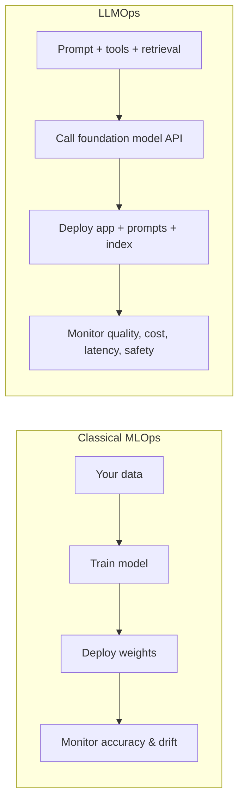
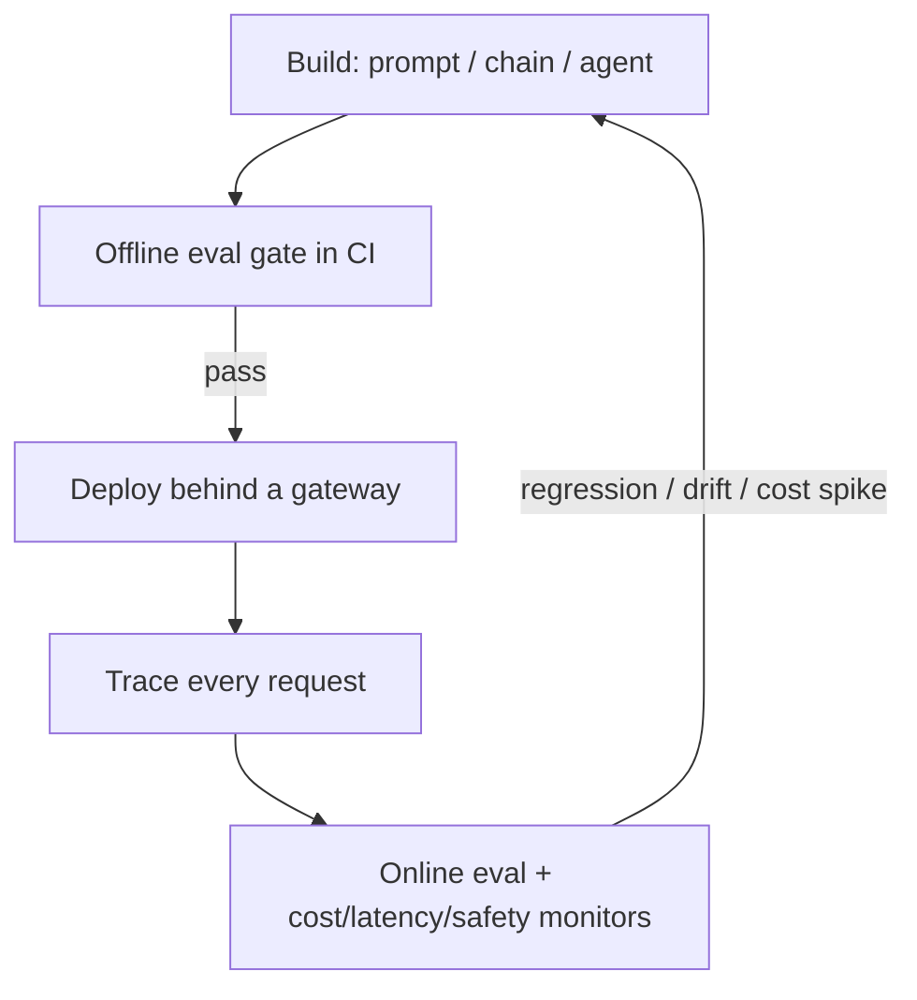

# Lesson 1 — Why LLMOps? (MLOps vs LLMOps)

> **One-liner:** LLMOps is MLOps re-pointed at applications built on foundation models — where the things you version, test, deploy, and monitor are prompts, chains, agents, retrieval indexes, and eval suites, and where "correct" is a *distribution of quality* rather than a single right answer.

---

## 🎯 TL;DR

Classical MLOps assumes *you trained the model on your data*, so its world revolves around datasets, training runs, and model weights. Most LLM apps don't train anything — they orchestrate a **non-deterministic, externally-hosted** model with prompts, tools, and retrieved context. That shifts the whole operations problem: your most important artifacts become **prompts and eval suites**, your biggest risks become **silent quality regressions and runaway cost**, and your core monitoring question changes from "is the pipeline up?" to "is the *output still good enough*?"

---

## 1. The mental model shift

You usually *don't own the model* — you own everything *around* it. That inversion is the whole reason LLMOps is its own discipline.

---

## 2. What's genuinely different

| Dimension | Classical MLOps | LLMOps |
|---|---|---|
| **Primary artifact** | Trained weights + dataset | Prompts, chains/graphs, retrieval index, eval suite |
| **Determinism** | Deterministic given weights | Non-deterministic (temperature, model updates) |
| **"Correct"** | Matches label | Passes a rubric / judge — a *range* of acceptable outputs |
| **Where compute lives** | Your training + serving infra | Often a third-party API you can't see inside |
| **Dominant cost** | GPU training hours | Per-token inference cost at runtime |
| **Fastest way to break prod** | New data distribution | A prompt edit or a provider model update |
| **Core monitor** | Accuracy / data drift | Output quality, hallucination rate, cost, latency, guardrail hits |
| **Release unit** | New model version | New prompt / chain / index / model-choice version |

---

## 3. The LLMOps loop

The loop is the same *shape* as MLOps (build → validate → ship → observe → feed back), but every box is instrumented around **quality + cost + safety**, not accuracy alone.

---

## 4. Why these roles pay so well

Almost everyone can wire a demo agent. Far fewer can answer *"it works in the notebook — now how do you deploy it, prove it won't regress, keep it under budget, and know within minutes when its answers get worse?"* That gap **is** the LLMOps job, and it's why Agentic-AI/LLM/MLOps roles command the premium. The rest of this module is the answer to that question.

---

## 5. Key terms

| Term | Meaning |
|------|---------|
| **LLMOps** | Operational practices for apps built on foundation models |
| **Foundation model** | A large pretrained model (often API-hosted) you build on rather than train |
| **Artifact** | A versioned thing you ship — here: prompts, chains, indexes, eval sets |
| **Quality regression** | Output gets worse without any error being thrown — the signature LLM failure |
| **Provider drift** | The upstream model changes under you, shifting behavior with no code change |

---

## ✍️ Notes / follow-ups
- This frames the module; the rest is the toolkit. Everything hangs off the loop in §3.
- Pairs with the classical view in [`../02_mlops/`](../02_mlops/README.md) — read both to see the same discipline through two lenses.
- Next: [Lesson 2 — Packaging & Serving an LLM/Agent App](02-packaging-and-serving.md).
