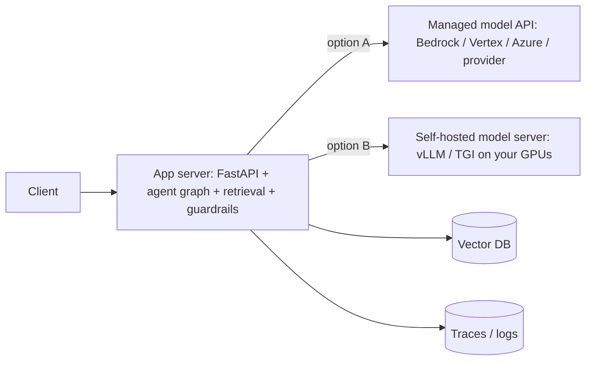
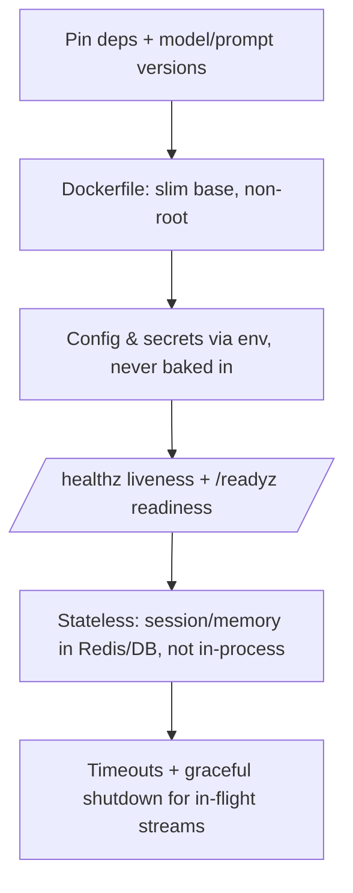

# Lesson 2 — Packaging & Serving an LLM/Agent App

> **One-liner:** Turn "runs on my laptop" into "a reproducible, scalable service" — containerize the app, expose the right kind of endpoint (sync vs streaming), and make the deliberate choice between a managed model API and self-hosted inference.

---

## 🎯 TL;DR

Serving an LLM app has two layers people conflate: the **model server** (the thing that runs the weights — vLLM/TGI, or someone else's API) and the **application server** (your FastAPI/service that holds the prompt, the agent graph, retrieval, and guardrails). You almost always deploy the *application* server; whether you also run the *model* server is the first big architectural fork. Package the app in a container, prefer **streaming** endpoints for chat UX, and keep the service **stateless** so it scales horizontally.

---

## 1. The two-layer picture

Your code is the **app server**. The model is a dependency behind it — swappable.

---

## 2. Managed API vs self-hosted model

| | Managed API (Bedrock/Vertex/Azure/provider) | Self-hosted (vLLM/TGI) |
|---|---|---|
| **Time to ship** | Minutes | Days–weeks (GPU, scaling, ops) |
| **Cost shape** | Per-token, scales with usage | Fixed GPU cost, cheaper at high volume |
| **Control / privacy** | Limited; data leaves your boundary | Full control, data stays in your VPC |
| **Ops burden** | Provider handles it | You own uptime, batching, autoscaling |
| **Best when** | Most apps, early stage, spiky traffic | High steady volume, strict privacy, custom/fine-tuned weights |

Rule of thumb: **start managed**, move specific high-volume or privacy-sensitive paths to self-hosted once the numbers justify the ops cost. (Inference internals for the self-hosted path live in [`AI/04`](../../AI/04_llm-serving-and-inference-optimization/README.md).)

---

## 3. Endpoint shapes

| Shape | Use for | Note |
|---|---|---|
| **Sync request/response** | Short classifications, tool results, batch jobs | Simplest; watch total latency budgets |
| **Streaming (SSE / chunked)** | Chat, long generations | Stream tokens so perceived latency ≈ time-to-first-token |
| **Async job + poll/webhook** | Long agent runs, multi-minute workflows | Return a job id; don't hold a socket open for minutes |

---

## 4. Container & service checklist

- **Stateless** is the single most important property — it's what lets you run N replicas and autoscale.
- Put conversation memory in an external store (see [`AI/14_memory`](../../AI/14_memory/README.md)), not in a module-level variable.
- Externalize the prompt and model choice as config so you can change them without a code deploy (sets up Lesson 4).

---

## 5. Key terms

| Term | Meaning |
|------|---------|
| **App server vs model server** | Your orchestration service vs the process running the weights |
| **Stateless service** | Holds no per-user state in memory; any replica can serve any request |
| **TTFT** | Time-to-first-token — the latency that actually matters for streaming UX |
| **Readiness vs liveness** | "Ready to take traffic" vs "process is alive" — different probes for autoscalers |
| **Sidecar** | A helper container (e.g., a gateway/proxy) deployed alongside the app |

---

## ✍️ Notes / follow-ups
- Once it's serving, you rarely point the app *directly* at a provider — you put a gateway in front. That's next.
- Streaming + cost internals connect to [`AI/04`](../../AI/04_llm-serving-and-inference-optimization/README.md) and Lesson 7.
- Next: [Lesson 3 — The LLM Gateway](03-llm-gateway-routing-and-cost.md).
