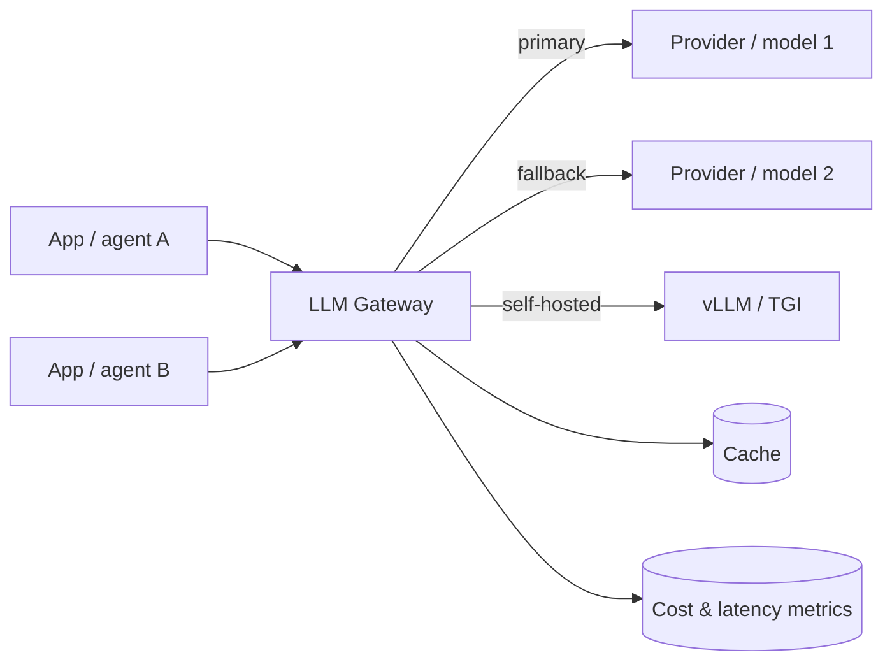
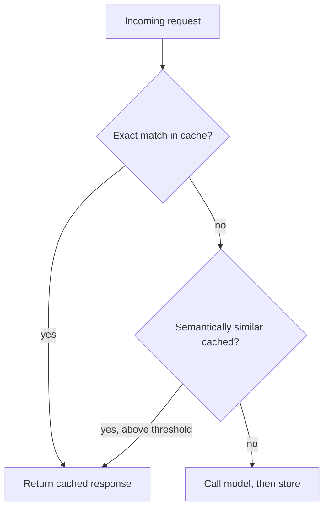

# Lesson 3 — The LLM Gateway: Routing, Fallbacks & Cost Control

> **One-liner:** Put a single proxy between your app and every model provider so that routing, retries, fallbacks, caching, rate limits, budgets, and API keys are solved **once, centrally** — instead of scattered through your application code.

---

## 🎯 TL;DR

Calling providers directly from app code means every service re-implements retries, timeouts, key rotation, and cost tracking — badly and inconsistently. An **LLM gateway** (LiteLLM, a cloud provider's model router, or a thin homegrown proxy) is a chokepoint that gives you one place to switch models, fall back when a provider is down, cache repeated calls, enforce per-team budgets, and get unified cost/latency metrics. It's the highest-leverage piece of LLMOps infrastructure.

---

## 1. Where it sits

One door in, many doors out — with a memory (cache) and a meter (metrics).

---

## 2. What the gateway does for you

| Capability | What it solves |
|---|---|
| **Model routing** | Send cheap/easy calls to a small model, hard calls to a frontier model — by rule or classifier |
| **Provider fallback** | Primary provider 5xx / rate-limited → automatically retry on a secondary |
| **Retries + circuit breaker** | Standardized backoff; stop hammering a failing provider |
| **Caching** | Return stored results for identical (or semantically similar) requests |
| **Rate limiting & budgets** | Per-user/team quotas; hard stop before a runaway loop drains the account |
| **Key management** | One place for provider keys + rotation; apps never hold raw keys |
| **Unified metrics** | Tokens, cost, latency, error rate per model/route/team in one schema |

---

## 3. Routing strategies

| Strategy | How it decides | Trade-off |
|---|---|---|
| **Static** | Config maps task → model | Simple; you tune it manually |
| **Cost-tiered** | Try cheap model; escalate if low-confidence / fails a check | Big savings; needs a confidence/eval signal |
| **Latency-based** | Route to fastest healthy provider | Great for SLOs; can bounce under load |
| **Capability-based** | Route by needed feature (vision, long context, tools) | Correctness-first; more rules to maintain |

Cost-tiered routing (small model first, escalate on failure) is usually the biggest single cost win — see Lesson 7.

---

## 4. Caching: two kinds

- **Exact-match cache** — same prompt → same answer. Safe, easy, big win for repeated queries.
- **Semantic cache** — embed the request, reuse a near-duplicate's answer above a similarity threshold. Powerful but needs a conservative threshold to avoid wrong answers.
- Distinct from **provider prompt caching** (caching a long shared prefix to cut input-token cost) — see [`AI/01`](../../AI/01_prompt-engineering/06-context-engineering.md) / Lesson 7.

---

## 5. Key terms

| Term | Meaning |
|------|---------|
| **LLM gateway** | Proxy centralizing routing, fallback, caching, budgets, and keys across providers |
| **Fallback chain** | Ordered list of models to try when earlier ones fail |
| **Circuit breaker** | Trips open after repeated failures so you stop calling a dead dependency |
| **Semantic cache** | Cache keyed by embedding similarity, not exact string match |
| **Budget / quota** | A hard spend or request ceiling enforced before the call is made |

---

## ✍️ Notes / follow-ups
- The gateway is *also* where a lot of Lesson 5 telemetry and Lesson 7 cost control naturally live.
- Fallbacks and budgets are load-bearing for Lesson 9's graceful degradation.
- Next: [Lesson 4 — CI/CD for LLM Apps with Eval Gates](04-cicd-with-eval-gates.md).
