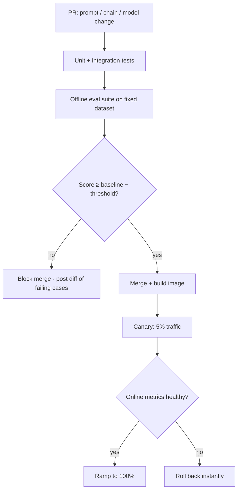
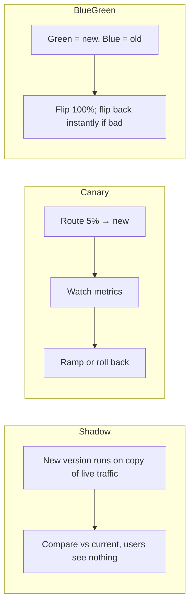

# Lesson 4 — CI/CD for LLM Apps with Eval Gates

> **One-liner:** Treat a prompt/chain/model change like any other code change — run an **eval suite** on every pull request and **block the merge if quality regresses**, then roll the change out gradually so a bad prompt can't take down all your traffic at once.

---

## 🎯 TL;DR

The scariest LLM bug is the one with no stack trace: someone "improves" a prompt, it ships, and answer quality quietly drops 8% for a week. The fix is to make **evals the unit tests of LLM apps**. Wire your offline eval suite (from [`AI/16_evals`](../../AI/16_evals/README.md)) into CI as a **gate**, version prompts/models as artifacts, and use **canary or shadow** rollouts so changes are validated on real traffic before they reach everyone.

---

## 1. The gated pipeline

---

## 2. What an eval gate checks

| Layer | Examples | Fails the gate when… |
|---|---|---|
| **Deterministic** | JSON schema valid, required fields present, no PII leak | Any hard rule breaks |
| **Reference-based** | Exact/fuzzy match, retrieval recall@k on a labeled set | Metric drops below baseline |
| **LLM-as-judge** | Faithfulness, helpfulness, tone rubric scores | Mean rubric score regresses beyond threshold |
| **Cost / latency** | Tokens per request, p95 latency on the eval set | A change makes it too slow or too expensive |

Set the gate as **"no worse than baseline minus ε"**, not "perfect" — you're catching *regressions*, not demanding a flawless model.

---

## 3. Prompts and models are versioned artifacts

| Practice | Why |
|---|---|
| **Prompts in version control** (or a prompt registry) | Every change is reviewable, diffable, revertable |
| **Pin the model + params** (`model`, `temperature`, `top_p`) | A silent provider update shouldn't change behavior invisibly |
| **Tag eval runs to a git SHA** | You can always answer "which version produced this quality?" |
| **Keep a golden dataset** | Stable yardstick; grow it every time prod surfaces a new failure (see Lesson 6) |

---

## 4. Rollout strategies

| Strategy | Best for | Cost |
|---|---|---|
| **Shadow** | Risky changes you want to test on real inputs safely | Doubles inference cost during the test |
| **Canary** | Most prompt/model changes | Small; needs online metrics |
| **Blue-green** | Fast, clean cutover with instant rollback | Two environments briefly |

---

## 5. Key terms

| Term | Meaning |
|------|---------|
| **Eval gate** | CI check that blocks a change when the eval suite regresses |
| **Golden dataset** | Curated, stable eval set representing what "good" means |
| **Canary** | Release to a small % of traffic first, then ramp |
| **Shadow (mirror)** | Run the new version on copied traffic without affecting users |
| **Regression threshold (ε)** | Allowed drop vs baseline before the gate fails |

---

## ✍️ Notes / follow-ups
- The eval suite here is the *offline* half; Lesson 6 turns the same rubrics into *online* monitors.
- Canary/blue-green depend on the online metrics you set up in Lesson 5.
- Next: [Lesson 5 — Production Observability & Tracing](05-observability-and-tracing.md).
