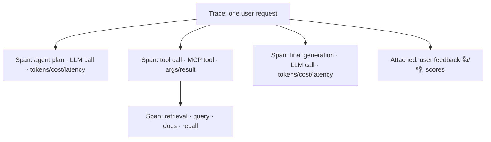
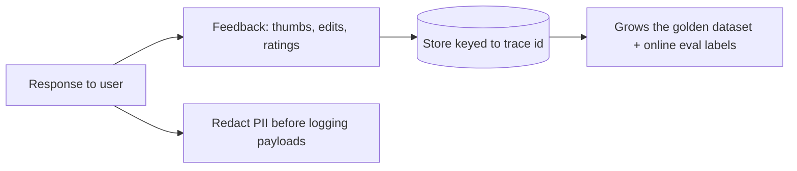

# Lesson 5 — Production Observability & Tracing

> **One-liner:** You can't operate what you can't see — instrument every request as a **trace** made of **spans** (each LLM call, tool call, and retrieval), and surface tokens, cost, latency, and user feedback on dashboards so problems are visible in minutes, not customer tickets.

> 🔗 **Hands-on with a concrete tool:** [`AI/30_langsmith/`](../../AI/30_langsmith/) — 18-lesson LangSmith tutorial (traces, `@traceable`, monitoring, evaluation, production hardening).
> 🔗 **Open-source alternative:** [`AI/32_langfuse/`](../../AI/32_langfuse/) — 13-lesson LangFuse tutorial (self-hosting, OpenTelemetry ingestion from any language, sessions, scores, experiments).

---

## 🎯 TL;DR

A production LLM request is a *tree*, not a single call: an agent step calls a tool, which triggers a retrieval, which feeds another LLM call. Standard app logs flatten that tree into noise. **Tracing** (LangSmith, Langfuse, or OpenTelemetry with GenAI conventions) captures the whole tree — inputs, outputs, timings, token counts, and cost per node — so you can answer "why was *this specific answer* wrong/slow/expensive?" Then you aggregate those traces into dashboards and capture user feedback as a first-class signal.

---

## 1. Trace = the unit of LLM observability

Each span records **input, output, duration, model, token counts, and cost**. This maps directly onto the LangGraph/LangSmith tracing you already saw in [`AI/13`](../../AI/13_langgraph/17_observability-langsmith-integration.md).

---

## 2. The three pillars, LLM-flavored

| Pillar | Classical | LLM-specific additions |
|---|---|---|
| **Traces** | Request spans | Prompt, completion, tokens, cost, tool args, retrieved docs |
| **Metrics** | RPS, latency, errors | Tokens/req, $/req, TTFT, cache-hit rate, guardrail-hit rate |
| **Logs** | App logs | Prompt/response payloads (**redacted** for PII) + feedback events |

---

## 3. What to put on the dashboard

| Panel | Why it earns its place |
|---|---|
| **p50 / p95 / p99 latency + TTFT** | UX and SLO tracking; frontier models are slow at the tail |
| **Tokens & cost per request (by route/model)** | Catch cost spikes and runaway loops early (Lesson 7) |
| **Error & fallback rate** | Provider health; how often the gateway is failing over |
| **Cache-hit rate** | Is caching actually helping? |
| **Guardrail-hit / refusal rate** | Safety signal + prompt-injection attempts (see [`AI/03`](../../AI/03_llm-security-and-guardrails/README.md)) |
| **👍/👎 and rubric scores over time** | The closest thing to "is quality holding?" (feeds Lesson 6) |

---

## 4. Capturing feedback & handling sensitive data

- **Tie feedback to the trace id** so a 👎 links back to the exact prompt/context/model that produced it — that's how you debug and how you grow the golden dataset (Lesson 4/6).
- **Redact/pseudonymize PII** before storing prompts/completions; log payloads are a common data-leak path.

---

## 5. Key terms

| Term | Meaning |
|------|---------|
| **Trace** | The full record of one request across all its calls |
| **Span** | One node in a trace (an LLM call, tool call, retrieval) |
| **OpenTelemetry (GenAI)** | Vendor-neutral standard for emitting traces/metrics, with LLM conventions |
| **TTFT** | Time-to-first-token |
| **Feedback loop** | Linking user signals back to traces to improve evals and prompts |

---

## ✍️ Notes / follow-ups
- Tracing gives you the raw material; Lesson 6 turns it into *automatic* quality monitoring and drift detection.
- Cost/latency panels here are the inputs to Lesson 7's optimization work.
- Next: [Lesson 6 — Monitoring & Drift for LLM Systems](06-monitoring-and-drift.md).
