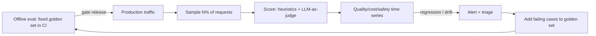
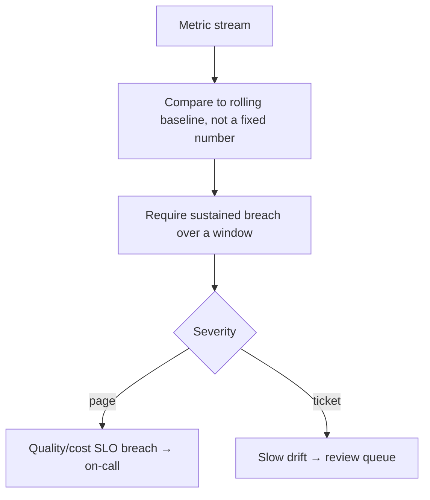

# Lesson 6 — Monitoring & Drift for LLM Systems

> **One-liner:** Tracing shows you *one* request; monitoring watches the *stream* — run online evals on a sample of live traffic, track quality/safety/cost as time series, and alert when inputs, retrieved context, or output quality **drift** away from what you validated in CI.

---

## 🎯 TL;DR

Offline evals (Lesson 4) prove a version is good *at release*. Production then changes underneath you: users ask new things, your knowledge base updates, and the provider silently ships a new model. **Online monitoring** samples real traffic, scores it with the same rubrics (LLM-as-judge + cheap heuristics), and watches for **drift** — in inputs, in retrieval, and in output quality — so you catch a slow-motion regression before it becomes a churned customer.

---

## 1. Offline vs online, one loop

The virtuous loop: **production failures become new offline test cases**, so the same bug can never regress twice.

---

## 2. The three drifts to watch

| Drift type | What moves | How you detect it |
|---|---|---|
| **Input drift** | Users ask new topics / longer / different language | Embedding-distribution shift; new-intent rate; input length stats |
| **Retrieval drift** (RAG) | Knowledge base grows/goes stale; recall drops | Recall@k on a labeled probe set; % answers with low-similarity context |
| **Output/quality drift** | Answers get worse, more refusals, more hallucinations | Online rubric scores; guardrail-hit rate; 👎 rate; groundedness score |

Provider drift (an upstream model update) usually shows up first as **output drift with no code change** — which is why pinning models (Lesson 4) matters.

---

## 3. What to score online (cheaply)

| Signal | Method | Cost |
|---|---|---|
| **Format validity** | Schema/regex checks | ~free |
| **Groundedness / faithfulness** | Is the answer supported by retrieved context? (judge) | Sample it |
| **Refusal / guardrail rate** | Count blocks & refusals | ~free |
| **Answer quality** | LLM-as-judge rubric on a sample | Sample 1–5% |
| **User satisfaction** | 👍/👎, edits, task completion | ~free, high signal |

You **sample** the expensive judges — you don't judge 100% of traffic. A few percent is enough to see a trend.

---

## 4. Alerting that doesn't cry wolf

- Alert on **sustained** deviation from a rolling baseline, not single noisy outliers (LLM metrics are inherently jumpy).
- Route **hard breaches** (cost spike, safety incident) to paging; route **slow drift** to a human review queue, not a 3 a.m. page.

---

## 5. Key terms

| Term | Meaning |
|------|---------|
| **Online eval** | Scoring live production traffic (usually sampled) |
| **Drift** | Divergence of inputs/context/quality from the validated baseline |
| **Groundedness** | Degree to which an answer is supported by retrieved context |
| **Rolling baseline** | A moving reference (e.g., 7-day median) you alert against |
| **Review queue** | Human-in-the-loop backlog for flagged/low-confidence outputs |

---

## ✍️ Notes / follow-ups
- Shares its rubrics with [`AI/16_evals`](../../AI/16_evals/README.md); the difference is *fixed dataset* (offline) vs *live sample* (online).
- Groundedness/recall monitoring closes the loop with your RAG work ([`AI/12`](../../AI/12_rag/README.md), [`AI/06`](../../AI/06_vector-databases/README.md)).
- Next: [Lesson 7 — Cost & Performance Engineering](07-cost-and-performance-engineering.md).
