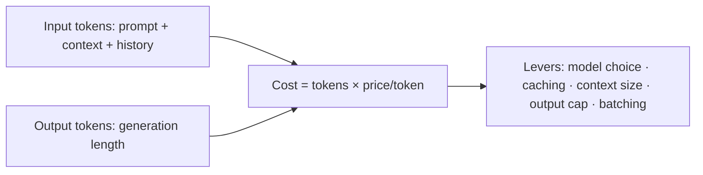
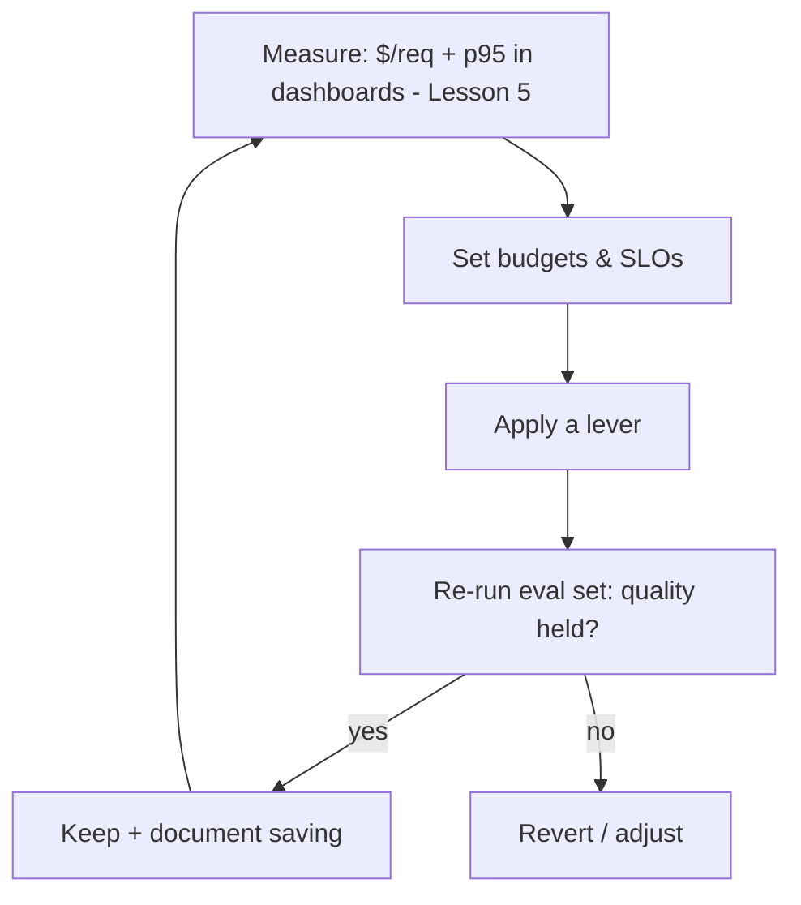

# Lesson 7 — Cost & Performance Engineering

> **One-liner:** LLM cost and latency are *engineered*, not accepted — measure cost-per-request and p95 latency as first-class SLOs, then pull the levers (right-size the model, cache, shorten context, batch, stream) in the order that gives the most savings for the least quality risk.

---

## 🎯 TL;DR

Cost = **(input tokens + output tokens) × price**, and latency is dominated by **output length + model size**. Both are controllable. The biggest, safest wins usually come in this order: **right-size the model** (don't use a frontier model for a classification), **cache** repeated work, **trim the context/prompt**, then **batch and stream**. Always measure against an eval set so an optimization can't silently trade away quality.

---

## 1. The cost equation & where the money goes

Two habits that surprise people: **retrieved context and chat history dominate input cost** (trim them), and **output tokens are often priced higher than input** (cap `max_tokens`, ask for concise answers).

---

## 2. The levers, ranked by ROI

| Lever | Typical saving | Quality risk | Notes |
|---|---|---|---|
| **Right-size the model** | 🟢🟢🟢 | Low–med | Cheap/small model for easy calls; escalate only when needed (cost-tiered routing, Lesson 3) |
| **Exact + semantic caching** | 🟢🟢🟢 | Low (exact) / med (semantic) | Huge for repetitive traffic; tune semantic threshold carefully |
| **Provider prompt caching** | 🟢🟢 | None | Cache the long shared prefix (system prompt, few-shot) to cut input cost |
| **Trim context & history** | 🟢🟢 | Low | Better retrieval + summarizing old turns beats stuffing the window |
| **Cap output length** | 🟢🟢 | Low | `max_tokens` + "be concise"; long outputs cost *and* slow |
| **Batching** (self-hosted) | 🟢🟢 | None | Continuous batching raises GPU throughput (see [`AI/04`](../../AI/04_llm-serving-and-inference-optimization/README.md)) |
| **Distillation / fine-tune a small model** | 🟢🟢🟢 | Med | Big win at scale; upfront effort (see [`AI/02`](../../AI/02_fine-tuning-and-alignment/README.md)) |

---

## 3. Latency: optimize what the user feels

| Technique | Effect |
|---|---|
| **Stream tokens** | Perceived latency ≈ time-to-first-token, not total time |
| **Smaller/faster model on the critical path** | Lower TTFT and per-token time |
| **Parallelize independent tool calls / retrievals** | Wall-clock = slowest branch, not the sum |
| **Speculative / cheap-first, verify-later** | Fast draft, escalate only if needed |
| **Cache the slow, deterministic steps** | Skip re-computation entirely |

---

## 4. Make it a discipline, not a one-off

Wire **budget alerts** (Lesson 6) and **gateway quotas** (Lesson 3) so cost can't run away between reviews. Every optimization gets an eval check-in so you never trade quality for pennies by accident.

---

## 5. Key terms

| Term | Meaning |
|------|---------|
| **Cost-per-request** | Average $ per served request — the headline cost SLO |
| **Right-sizing** | Matching model capability to task difficulty instead of always using the biggest |
| **Prompt caching** | Provider feature caching a repeated prompt prefix to cut input cost |
| **Continuous batching** | Serving trick that packs requests to maximize GPU utilization |
| **Speculative execution** | Draft with a cheap/fast model, verify/escalate only when needed |

---

## ✍️ Notes / follow-ups
- The measurement half lives in Lesson 5; the enforcement half (quotas/budgets) in Lessons 3 & 6.
- Deep inference mechanics (KV-cache, quantization, vLLM) are in [`AI/04`](../../AI/04_llm-serving-and-inference-optimization/README.md).
- Next: [Lesson 8 — Cloud AI Platforms & Infrastructure as Code](08-cloud-ai-platforms-and-iac.md).
