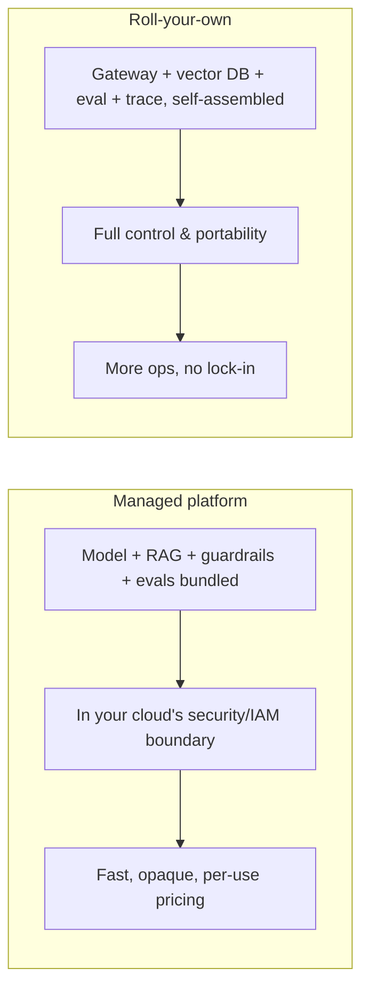
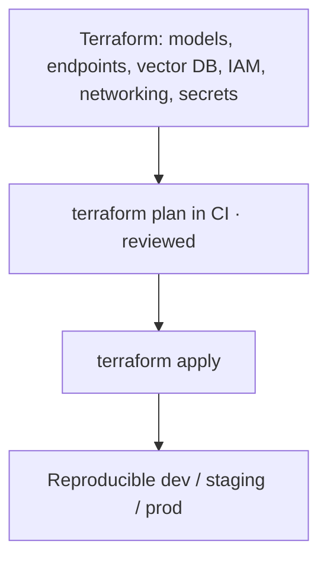

# Lesson 8 — Cloud AI Platforms & Infrastructure as Code

> **One-liner:** Know the three managed AI platforms (AWS **Bedrock**, GCP **Vertex AI**, Azure **AI Foundry**) and when to reach for each, and provision all of it with **Infrastructure as Code** (Terraform) so your AI stack is reproducible, reviewable, and not a pile of hand-clicked console settings.

---

## 🎯 TL;DR

Most companies don't call providers directly in prod — they go through a **cloud AI platform** that bundles model access, managed RAG, guardrails, evaluation, and monitoring inside their existing security/networking boundary. The big three (Bedrock, Vertex AI, Azure AI Foundry) are broadly comparable; the choice is usually dictated by **which cloud you're already on**. Whichever you pick, define it as **code** (Terraform) so environments are identical and changes go through review.

---

## 1. The managed-platform landscape

| Platform | Cloud | Model access | Notable managed pieces |
|---|---|---|---|
| **Amazon Bedrock** | AWS | Anthropic, Meta, Mistral, Amazon, others | Knowledge Bases (RAG), Agents, Guardrails, Evaluations |
| **Google Vertex AI** | GCP | Gemini + Model Garden (incl. open + partner) | RAG Engine, Agent Builder, eval & pipelines, tuning |
| **Azure AI Foundry** | Azure | Azure OpenAI + model catalog | Prompt flow, content safety, evaluation, agent service |
| **Amazon SageMaker** | AWS | Bring/train/host **your own** models | Training, endpoints, pipelines, model registry, monitor |

Rule of thumb: **Bedrock/Vertex/Foundry** for building *on* foundation models; **SageMaker** (or Vertex training) when you're *training/hosting your own* — the classical-MLOps path from [`../02_mlops/`](../02_mlops/README.md).

---

## 2. Managed platform vs roll-your-own

| | Managed platform | Roll-your-own |
|---|---|---|
| **Speed to prod** | Fast | Slower |
| **Portability / lock-in** | More lock-in | Portable across clouds |
| **Control & customization** | Bounded by the platform | Total |
| **Best for** | Teams already committed to one cloud | Multi-cloud, special requirements, cost at scale |

A common middle path: managed **model + guardrails**, but your **own gateway, eval, and tracing** (Lessons 3–6) so those stay portable.

---

## 3. Why Infrastructure as Code is non-negotiable

| Hand-clicked console | Terraform / IaC |
|---|---|
| "Works in staging, missing in prod" | Same definition → identical environments |
| No history of who changed what | Every change is a reviewed, versioned diff |
| Disaster recovery = tribal memory | `terraform apply` rebuilds it |
| Secrets pasted into fields | Wired to a secret manager by reference |

Provision the boring-but-critical parts as code too: **IAM roles** (least privilege for model + data access), **VPC/networking** (keep traffic private), and **secrets** (via a manager, never in the repo).

---

## 4. Security & networking baseline

| Concern | Baseline practice |
|---|---|
| **Data boundary** | Keep prompts/embeddings/logs in your VPC/region; know what leaves it |
| **IAM** | Least-privilege roles for model invocation and data stores |
| **Secrets** | Central secret manager; rotation; no keys in images/repos (ties to Lesson 3) |
| **Private connectivity** | Private endpoints to model/vector services where offered |
| **Compliance** | Match region/residency + retention to your data-governance rules |

---

## 5. Key terms

| Term | Meaning |
|------|---------|
| **Managed AI platform** | Cloud bundle of model access + RAG + guardrails + eval + monitoring |
| **Model Garden / catalog** | The platform's menu of hostable models |
| **Infrastructure as Code (IaC)** | Declaring infra in versioned files (Terraform) instead of console clicks |
| **IAM** | Identity & access management — who/what may call which resource |
| **Vendor lock-in** | Cost/effort of moving off a platform you've built deeply into |

---

## ✍️ Notes / follow-ups
- Managed *guardrails/evals* here overlap with [`AI/03`](../../AI/03_llm-security-and-guardrails/README.md) and [`AI/16`](../../AI/16_evals/README.md) — the platform is just one place to run them.
- SageMaker/Vertex-training paths connect back to classical [`../02_mlops/`](../02_mlops/README.md).
- 🔎 **Deep dive:** hands-on per-platform detail (Bedrock/Vertex/Azure), IaC, and multi-cloud/cost live in the dedicated [Cloud AI Platforms module](../04_cloud-ai-platforms/README.md).
- Next: [Lesson 9 — Reliability, Incidents & the Go-Live Checklist](09-reliability-incidents-and-go-live-checklist.md).
