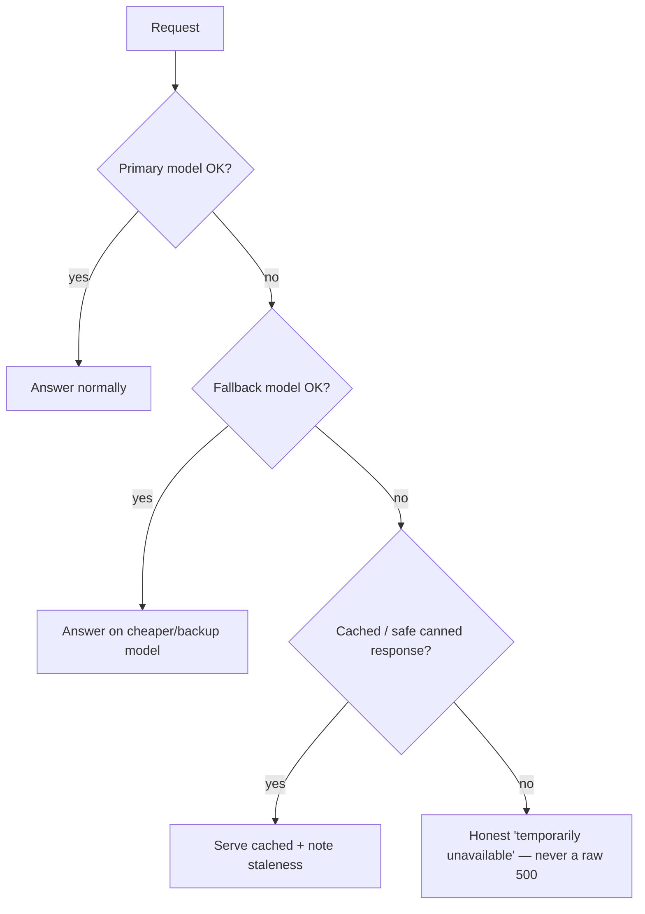
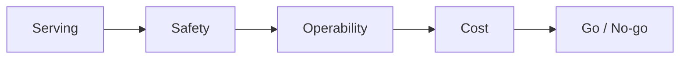

# Lesson 9 — Reliability, Incidents & the Go-Live Checklist

> **One-liner:** Production LLM systems fail in ways classical services don't (provider outages, rate limits, prompt regressions, hallucination spikes) — so design for **graceful degradation**, write **runbooks** for AI-specific incidents, and gate every launch behind a **production-readiness checklist**. This is the capstone that ties Lessons 1–8 together.

---

## 🎯 TL;DR

Reliability for LLM apps means two things: **stay up** (survive provider outages and rate limits without a hard failure) and **stay good** (catch quality/safety regressions fast). The tools are already in this module — gateway fallbacks (L3), eval gates (L4), tracing (L5), monitoring/alerts (L6), budgets (L7). This lesson assembles them into **failure-mode planning, incident runbooks, and a go-live checklist** so "it works in the demo" becomes "it's safe to depend on."

---

## 1. Failure modes unique to LLM systems

| Failure | Symptom | Mitigation (lesson) |
|---|---|---|
| **Provider outage / 5xx** | Requests fail upstream | Fallback chain in the gateway (L3) |
| **Rate limit / quota** | 429s under load | Backoff + secondary provider + request queue (L3) |
| **Latency blowout** | p99 spikes, timeouts | Timeouts, smaller model fallback, streaming (L2/L7) |
| **Prompt/model regression** | Quality drops, no error | Eval gate (L4) + online monitoring (L6) + fast rollback |
| **Hallucination / safety spike** | Wrong or unsafe answers | Guardrails + groundedness monitor + kill-switch (L5/L6) |
| **Cost runaway** | Spend spikes (often a loop) | Budgets/quotas + loop limits + alerts (L3/L7) |
| **Retrieval outage / stale index** | Answers lose grounding | Health-check the vector store; degrade to no-RAG note (L6) |

---

## 2. Design for graceful degradation

The principle: **every failure path ends in something a user can accept** — a backup model, a cached answer, or an honest message — never an unhandled error or, worse, a confident wrong answer.

---

## 3. AI incident response

| Step | LLM-specific action |
|---|---|
| **Detect** | Alert fires (L6): quality drop, cost spike, safety-rate spike, error surge |
| **Triage** | Open the offending **traces** (L5) — is it provider, prompt, retrieval, or input drift? |
| **Mitigate** | Roll back the prompt/model version (L4); flip gateway to fallback (L3); trip a **kill-switch** for the bad feature |
| **Resolve** | Fix root cause; ship gated by evals (L4) |
| **Learn** | Add the failing cases to the **golden dataset** (L6) so it can't regress again; write the postmortem |

Two AI-specific must-haves: a **kill-switch / feature flag** to disable an AI feature instantly, and **fast version rollback** because your worst outages are silent quality ones, not crashes.

---

## 4. The production-readiness checklist

| Area | ✅ Before you launch |
|---|---|
| **Serving (L2)** | Containerized, stateless, health/readiness probes, streaming, sane timeouts |
| **Traffic (L3)** | Behind a gateway; fallback chain; retries + circuit breaker; keys in a secret manager |
| **Release (L4)** | Eval gate in CI; prompts/models versioned & pinned; canary or blue-green rollout wired |
| **Observability (L5)** | Tracing on 100% of requests; dashboards for latency/cost/errors/feedback; PII redacted in logs |
| **Monitoring (L6)** | Online eval sampling; drift + quality + safety alerts on rolling baselines; review queue |
| **Cost (L7)** | $/req + p95 SLOs set; budgets/quotas enforced; loop/output caps |
| **Infra (L8)** | Defined in IaC; least-privilege IAM; private networking; region/retention compliant |
| **Reliability (L9)** | Graceful-degradation paths; kill-switch/feature flags; rollback tested; runbook written |

If a row is unchecked, that's your next task — not your launch blocker's surprise.

---

## 5. Key terms

| Term | Meaning |
|------|---------|
| **Graceful degradation** | Failing to a worse-but-acceptable response instead of an error |
| **Kill-switch / feature flag** | A control to instantly disable an AI feature or route |
| **Runbook** | A written, step-by-step response for a known incident type |
| **Postmortem** | Blameless write-up of an incident and the fixes it drove |
| **Production-readiness checklist** | The go/no-go gate summarizing the whole module |

---

## ✍️ Notes / follow-ups
- This is the capstone: every row of the §4 checklist points back to a lesson in this module.
- Pair the checklist with your build projects — it's exactly the "productionize" rubric for the portfolio's Build #3.
- Loops back to [Lesson 1](01-why-llmops.md): the goal was never a demo, it was a system you can *depend on*.
