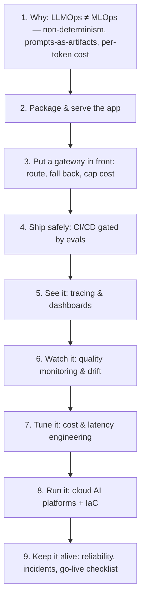

# 🚀 LLMOps — Taking LLM & Agent Apps to Production

> The **"operate it" half** of the stack. The rest of this repo teaches you to *build* LLM and agent applications — prompting, RAG, LangGraph, MCP, evals, fine-tuning. This module is how you **ship, serve, monitor, and keep them alive in production**: the LLMOps / AI-Platform layer that the highest-paying Agentic-AI, LLM-Engineer, and MLOps roles actually hire for.
>
> Think of it as the LLM-native sibling of [`02_mlops/`](../02_mlops/README.md): classical MLOps operates *models trained on your data*; LLMOps operates *applications built on top of (mostly external, non-deterministic) foundation models*, where the artifacts are prompts, chains, agents, retrieval indexes, and eval suites — not just model weights.

---

## Lessons

| # | Lesson | Theme | Status |
|---|--------|:------|:------:|
| 1 | [Why LLMOps? (MLOps vs LLMOps)](01-why-llmops.md) | Framing | ✅ |
| 2 | [Packaging & Serving an LLM/Agent App](02-packaging-and-serving.md) | Deploy | ✅ |
| 3 | [The LLM Gateway: Routing, Fallbacks & Cost Control](03-llm-gateway-routing-and-cost.md) | Traffic layer | ✅ |
| 4 | [CI/CD for LLM Apps with Eval Gates](04-cicd-with-eval-gates.md) | Release safety | ✅ |
| 5 | [Production Observability & Tracing](05-observability-and-tracing.md) | See it | ✅ |
| 6 | [Monitoring & Drift for LLM Systems](06-monitoring-and-drift.md) | Watch it | ✅ |
| 7 | [Cost & Performance Engineering](07-cost-and-performance-engineering.md) | Make it cheap & fast | ✅ |
| 8 | [Cloud AI Platforms & Infrastructure as Code](08-cloud-ai-platforms-and-iac.md) | Where it runs | ✅ |
| 9 | [Reliability, Incidents & the Go-Live Checklist](09-reliability-incidents-and-go-live-checklist.md) | Keep it alive (capstone) | ✅ |

---

## The arc (how the lessons connect)

- **1–2** = get it *running* (frame + deploy).
- **3–4** = get it *safe* (traffic control + gated releases).
- **5–6** = get it *observable* (see it, then watch it for regressions).
- **7–8** = get it *efficient and reproducible* (cost/latency + infra).
- **9** = get it *dependable* (the capstone checklist that ties it all together).

---

## Core cheat-sheet

| Concept | In one line |
|---------|-------------|
| **LLMOps** | MLOps adapted to apps built on foundation models — where prompts, chains, retrieval, and evals are first-class artifacts |
| **Non-determinism** | Same input can give different output → you monitor *distributions of quality*, not exact outputs |
| **Eval gate** | A CI check that blocks a deploy when an eval suite regresses — the LLM equivalent of a failing unit test |
| **LLM gateway** | A proxy in front of model providers doing routing, fallbacks, retries, caching, budgets, and key management |
| **Trace / span** | The record of one request's full path (LLM calls, tool calls, retrievals) — the unit of LLM observability |
| **Online vs offline eval** | Offline = against a fixed dataset in CI; online = scoring real production traffic |
| **Drift** | Inputs, retrieved context, or output quality diverge from what you validated against |
| **Token economics** | Cost = (input + output tokens) × price; the lever behind caching, routing, and right-sizing |
| **Managed vs self-hosted** | Bedrock/Vertex/Azure (fast, opaque, per-token) vs vLLM/TGI on your GPUs (control, fixed cost, ops burden) |
| **Graceful degradation** | When the primary model/provider fails, serve a cheaper model / cached answer / honest fallback — never a hard error |

---

## How this connects to the rest of the repo

| You learned to build… | …here you learn to operate it |
|---|---|
| Inference internals — vLLM, KV-cache, batching, quantization ([`AI/04`](../../AI/04_llm-serving-and-inference-optimization/README.md)) | Lesson 2 & 7 — serving the *application* around that engine, and the cost/latency discipline |
| Evals — LLM-as-judge, offline/online ([`AI/16`](../../AI/16_evals/README.md)) | Lesson 4 & 6 — wiring evals into CI as gates and into production as monitors |
| Guardrails & security ([`AI/03`](../../AI/03_llm-security-and-guardrails/README.md)) | Lesson 5 & 9 — guardrail-hit rates as a monitored signal; incident response |
| LangGraph + LangSmith, MCP ([`AI/13`](../../AI/13_langgraph/README.md), [`AI/15`](../../AI/15_mcp/README.md)) | Lesson 5 — tracing agent steps and tool calls as spans |
| The reusable RAG-agent stack ([`AI/18_ragapp`](../../AI/18_ragapp/README.md)) | This whole module — the ops plan for exactly that kind of app |
| Classical MLOps lifecycle ([`Shared/02`](../02_mlops/README.md)) | The LLM-native counterpart — same discipline, different artifacts |

---

## A note on sourcing

Unlike the playlist-based modules, this one has no single video source. Consistent with the repo's [`claude-code/`](../../AI/17_claude-code/README.md), [`reinforcement-learning/`](../../DL/04_reinforcement-learning/README.md), and [`mlops/`](../02_mlops/README.md) notes, these pages are distilled from established LLMOps/MLOps practice and the canonical documentation of the tools referenced (Docker, FastAPI, vLLM/TGI, LiteLLM, LangSmith/Langfuse/OpenTelemetry, MLflow, GitHub Actions, Terraform, and the AWS Bedrock / GCP Vertex AI / Azure AI platforms).

---

## How each page is structured
- **TL;DR** — the one thing to remember.
- **Core concepts** — distilled, with tables and Mermaid diagrams.
- **Key terms** — quick glossary.
- **Notes** — cross-links to related lessons + pointer to what's next.
