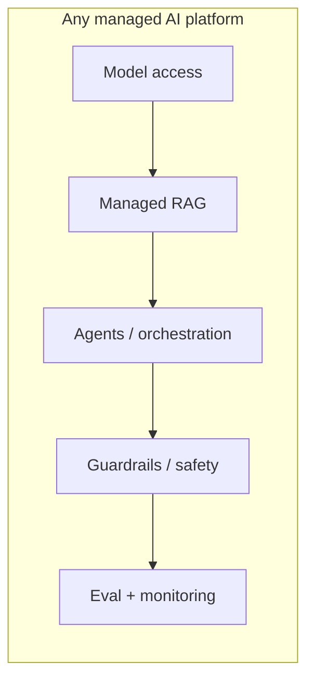
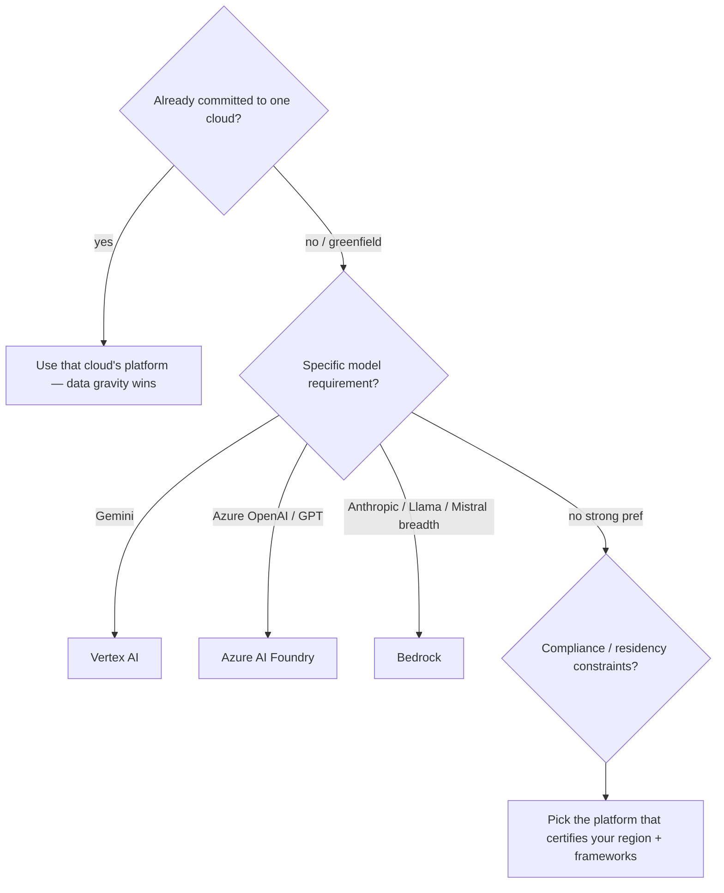

# Lesson 1 — The Landscape & How to Choose

> **One-liner:** The three managed AI platforms (Bedrock, Vertex AI, Azure AI Foundry) are more alike than different — they all bundle model access + managed RAG + agents + guardrails + eval — so the decision is driven less by feature checklists and more by **which cloud your data and team already live in**, plus which models and compliance boundaries you need.

---

## 🎯 TL;DR

Don't start by comparing feature matrices; start with three questions: **Which cloud are we already on?** (data gravity + billing + IAM usually decide it), **Which models must we run?** (Gemini → Vertex; Azure OpenAI → Azure; Anthropic/Llama/Mistral breadth → Bedrock), and **What are our data-residency/compliance constraints?** Only then compare the RAG/agent/guardrail building blocks. For most teams the answer is "the platform on the cloud we already use," and the interesting engineering is keeping the *portable* pieces (gateway, evals, tracing) yours.

---

## 1. What every platform gives you (same five boxes, different names)

| Building block | Bedrock | Vertex AI | Azure AI Foundry |
|---|---|---|---|
| **Model access** | Bedrock model catalog | Model Garden + Gemini | Azure OpenAI + model catalog |
| **Managed RAG** | Knowledge Bases | RAG Engine / Vertex AI Search | Azure AI Search integration |
| **Agents** | Bedrock Agents | Agent Builder / ADK | Azure AI Agent Service |
| **Guardrails** | Bedrock Guardrails | Model Armor / safety filters | Content Safety |
| **Eval/monitor** | Bedrock Evaluations | Gen AI Eval Service | Evaluation in Foundry |

---

## 2. The decision framework

| Decision driver | Weight | Why |
|---|---|---|
| **Existing cloud + data location** | 🟢🟢🟢 | Egress cost, IAM, and latency all favor staying put |
| **Required models** | 🟢🟢 | Some models are effectively exclusive to one platform |
| **Compliance / region / residency** | 🟢🟢 | Not all models are available in all regions/certifications |
| **Team skills / existing IaC** | 🟢 | Reuse your Terraform + ops muscle |
| **Raw feature deltas** | 🟢 | Smaller than vendors imply; they converge fast |

---

## 3. Managed vs assemble-your-own (recap + when to escape)

| | Managed platform feature | Your own component |
|---|---|---|
| **RAG** | Fast to stand up; opaque chunking/tuning | Full control of the pipeline ([data-eng module](../../AI/20_data-engineering-for-rag/README.md)) |
| **Guardrails** | One toggle; limited customization | Exactly your policy ([`AI/03`](../../AI/03_llm-security-and-guardrails/README.md)) |
| **Eval** | Convenient, platform-shaped | Portable, reproducible ([`AI/16`](../../AI/16_evals/README.md)) |

Common middle path: **managed model + managed guardrails**, but **your own gateway, RAG pipeline, evals, and tracing** — so the expensive-to-rebuild, portability-critical pieces don't get welded to one vendor (Lesson 6).

---

## 4. Key terms

| Term | Meaning |
|------|---------|
| **Data gravity** | Tendency for compute to move to where the data already is (cost + latency) |
| **Model catalog / garden** | The platform's menu of models you can deploy/invoke |
| **Managed RAG** | Platform-run ingestion→retrieval so you don't build the pipeline |
| **Residency** | Legal/contractual requirement that data stays in a region |
| **Escape hatch** | Keeping a component yours so you can leave the platform without a rewrite |

---

## ✍️ Notes / follow-ups
- Lessons 2–4 are deliberately the same shape (setup → invoke → managed RAG → agents → guardrails → gotchas) so you can compare platforms fairly.
- The "keep it portable" theme pays off in Lesson 6.
- Next: [Lesson 2 — AWS Bedrock (Hands-On)](02-aws-bedrock-hands-on.md).
