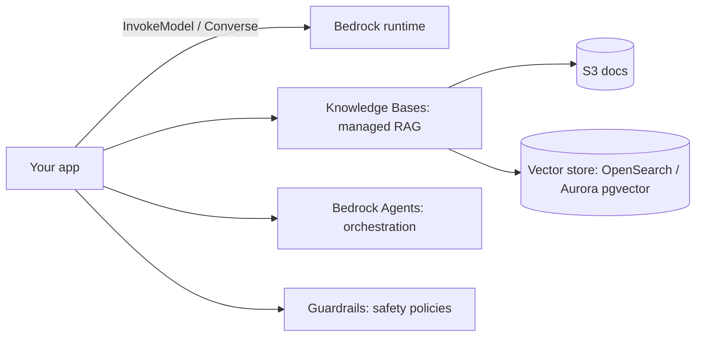
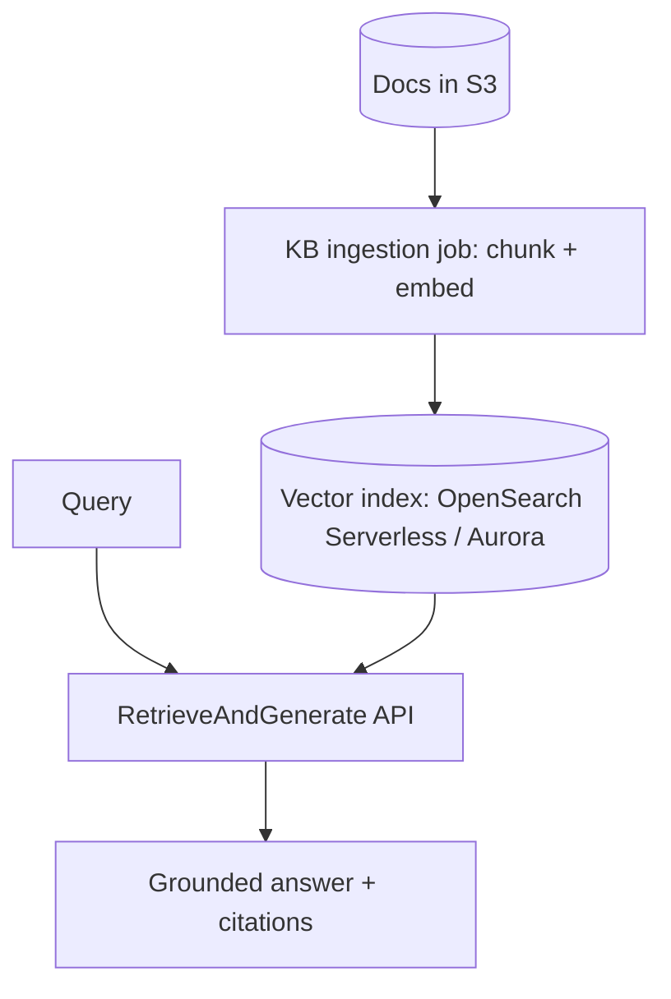

# Lesson 2 — AWS Bedrock (Hands-On)

> **One-liner:** Bedrock is AWS's serverless door to many model families (Anthropic, Meta, Mistral, Amazon, Cohere) behind one IAM-governed API — enable model access, call the unified `converse` API, and layer on **Knowledge Bases** (managed RAG), **Agents**, and **Guardrails** without running any inference infra yourself.

---

## 🎯 TL;DR

Bedrock's pitch: no endpoints to manage, pay per token, everything inside your AWS account's IAM/VPC boundary. The two gotchas that trip up newcomers: (1) you must **explicitly request model access** per model in the console before you can call it, and (2) **model availability is region-specific**. Once past those, the `converse` API gives you a single, model-agnostic call shape with tool use and streaming.

---

## 1. The pieces



| Service | What it is |
|---|---|
| **Bedrock Runtime** | The invoke/`converse` API for text, tools, streaming |
| **Knowledge Bases** | Managed RAG: point at S3 → it chunks, embeds, indexes, retrieves |
| **Bedrock Agents** | Managed agent loop: tools (Lambda "action groups") + KB + reasoning |
| **Guardrails** | Config-driven content filters, denied topics, PII redaction, word filters |
| **Evaluations** | Built-in model/RAG evaluation jobs |

---

## 2. First call — the `converse` API

```python
# Illustrative shape — confirm against current boto3 docs.
import boto3
client = boto3.client("bedrock-runtime", region_name="us-east-1")

resp = client.converse(
    modelId="anthropic.claude-...",              # a model you've enabled
    messages=[{"role": "user", "content": [{"text": "Summarize our return policy."}]}],
    inferenceConfig={"maxTokens": 512, "temperature": 0},
)
print(resp["output"]["message"]["content"][0]["text"])
```

- `converse` (and `converse_stream`) is **model-agnostic** — swap `modelId` without rewriting the call. Prefer it over the older per-provider `invoke_model` body formats.
- Tool use and system prompts are first-class fields on `converse`.

---

## 3. Managed RAG with Knowledge Bases



- You bring an **S3 bucket of docs** + choose an **embedding model**; Bedrock runs chunk→embed→index.
- Query via `retrieve` (chunks only) or `retrieve_and_generate` (chunks + answer with citations).
- Trade-off vs your own pipeline: fast to stand up, but chunking/reranking knobs are limited — see the [data-engineering module](../../AI/20_data-engineering-for-rag/README.md) for when you'd outgrow it.

---

## 4. Guardrails & IAM (the AWS-native bits)

| Concern | Bedrock answer |
|---|---|
| **Safety** | **Guardrails**: denied topics, content filters, PII redaction, word/regex filters — attach to any `converse` call |
| **Access** | IAM policy granting `bedrock:InvokeModel` (+ KB/agent actions), scoped to specific model ARNs |
| **Privacy** | Requests stay in your account/region; opt out of any training use per policy |
| **Networking** | VPC endpoints (PrivateLink) keep traffic off the public internet |

---

## 5. Key terms

| Term | Meaning |
|------|---------|
| **`converse` API** | Bedrock's unified, model-agnostic chat/tool/stream call |
| **Model access request** | The per-model console opt-in required before invocation |
| **Knowledge Base** | Bedrock's managed RAG over your S3 docs |
| **Action group** | A Lambda-backed tool a Bedrock Agent can call |
| **Guardrail** | Attachable safety policy (topics, PII, filters) |

---

## ✍️ Notes / follow-ups
- Bedrock Guardrails is a managed alternative to the DIY approaches in [`AI/03`](../../AI/03_llm-security-and-guardrails/README.md) — same goals, less control.
- Same shape as the next two lessons — compare KB vs RAG Engine vs Azure AI Search.
- Next: [Lesson 3 — GCP Vertex AI (Hands-On)](03-gcp-vertex-ai-hands-on.md).
