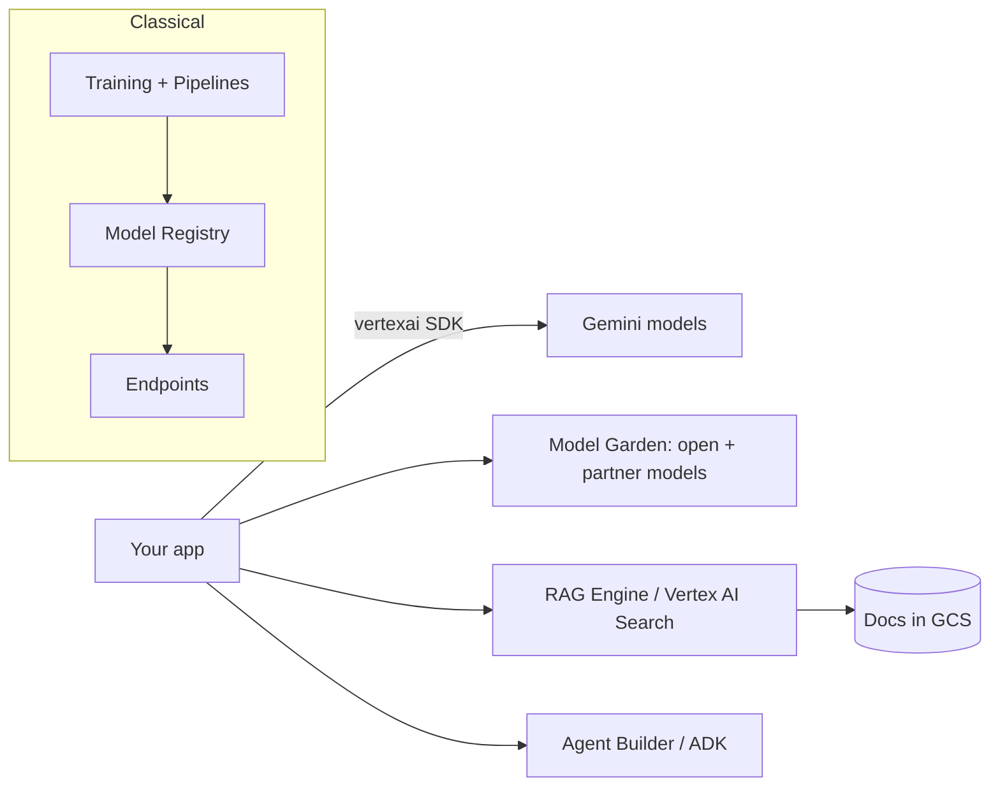
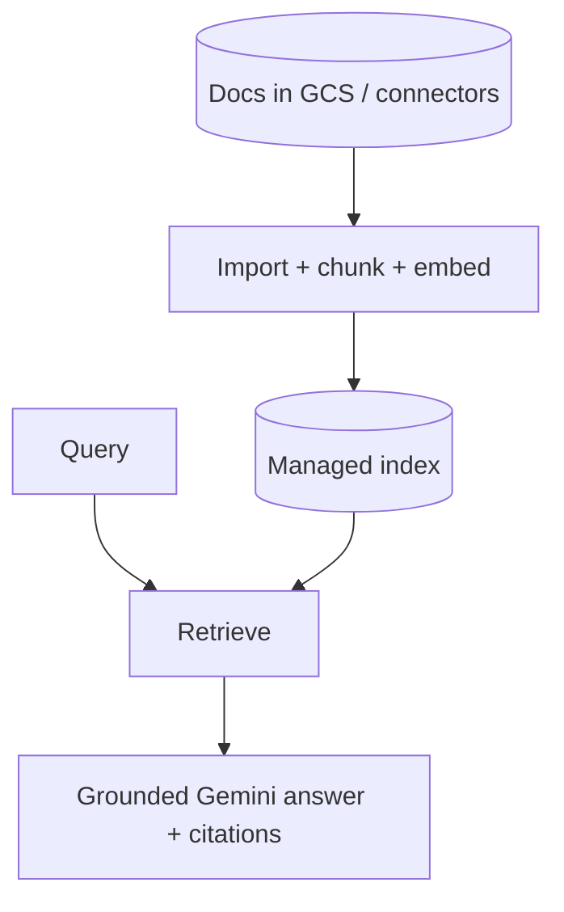

# Lesson 3 — GCP Vertex AI (Hands-On)

> **One-liner:** Vertex AI is Google Cloud's end-to-end ML+GenAI platform — native **Gemini** access plus a **Model Garden** of open/partner models, a managed **RAG Engine** / **Vertex AI Search**, **Agent Builder / ADK** for agents, and the same training/serving stack classical ML uses — all under one GCP project and IAM.

---

## 🎯 TL;DR

Vertex's edge is breadth: it's both the *GenAI* platform (Gemini, RAG Engine, Agent Builder) **and** the *classical ML* platform (training, pipelines, endpoints, registry) in one place — so it's a natural fit if you do both. Auth is GCP-standard (ADC / service accounts), you work inside a **project + region**, and Gemini is multimodal by default (text, image, audio, video, long context).

---

## 1. The pieces



| Service | What it is |
|---|---|
| **Gemini API (on Vertex)** | Google's multimodal frontier models, project-scoped |
| **Model Garden** | Deploy open/partner models (Llama, Gemma, etc.) to endpoints |
| **RAG Engine / Vertex AI Search** | Managed retrieval — RAG Engine (developer RAG) or AI Search (enterprise search) |
| **Agent Builder / ADK** | Build agents; the Agent Development Kit is Google's agent framework |
| **Training / Pipelines / Registry / Endpoints** | The classical MLOps stack (Lesson 5) |

---

## 2. First call — the `vertexai` SDK

```python
# Illustrative shape — confirm against current google-cloud-aiplatform docs.
import vertexai
from vertexai.generative_models import GenerativeModel

vertexai.init(project="my-project", location="us-central1")
model = GenerativeModel("gemini-...")
resp = model.generate_content("Summarize our return policy.")
print(resp.text)
```

- Auth via **Application Default Credentials** (`gcloud auth application-default login`) or a service account — no API key in code.
- Everything is scoped to a **project + location (region)**; multimodal inputs (images, PDFs, audio) are passed as parts.

---

## 3. Managed RAG: RAG Engine vs Vertex AI Search



| Option | Best for |
|---|---|
| **RAG Engine** | Developer-controlled RAG grounded into Gemini calls |
| **Vertex AI Search** | Turnkey enterprise search/RAG over your corpus with connectors |
| **Grounding with Google Search** | Ground answers on the public web when appropriate |

As with Bedrock KB, this is fast but opinionated — outgrow it via the [data-engineering module](../../AI/20_data-engineering-for-rag/README.md).

---

## 4. Agents, tuning & IAM

| Concern | Vertex answer |
|---|---|
| **Agents** | Agent Builder + **ADK** (Agent Development Kit); tool use + grounding built in |
| **Tuning** | Supervised fine-tuning / distillation for Gemini and Model-Garden models |
| **Safety** | Configurable safety filters + Model Armor |
| **Access** | GCP IAM roles (e.g., Vertex AI User); service accounts, no static keys |
| **Networking** | VPC Service Controls + Private Service Connect for a private data boundary |

---

## 5. Key terms

| Term | Meaning |
|------|---------|
| **Project + location** | The GCP scoping unit for all Vertex resources |
| **ADC** | Application Default Credentials — GCP's keyless auth for SDKs |
| **Model Garden** | Vertex's catalog of deployable open/partner models |
| **RAG Engine / Vertex AI Search** | Google's managed retrieval options |
| **ADK** | Agent Development Kit — Google's agent-building framework |

---

## ✍️ Notes / follow-ups
- Vertex is the platform where this module and the classical [`../02_mlops/`](../02_mlops/README.md) world overlap most — Lesson 5 covers the training side.
- Compare its RAG Engine to Bedrock KB (Lesson 2) and Azure AI Search (Lesson 4).
- Next: [Lesson 4 — Azure AI Foundry (Hands-On)](04-azure-ai-foundry-hands-on.md).
