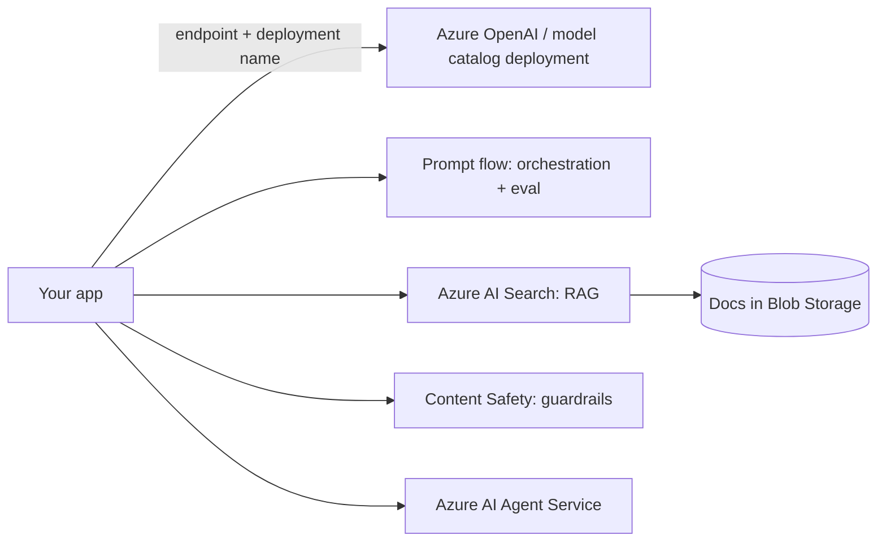
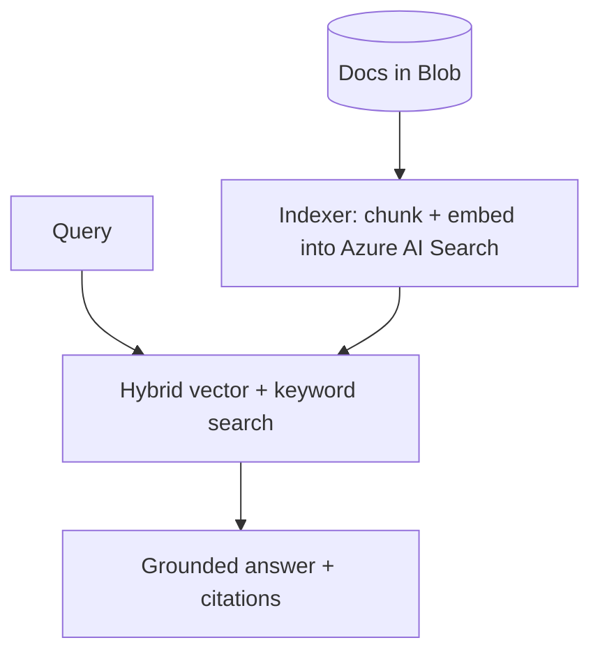

# Lesson 4 — Azure AI Foundry (Hands-On)

> **One-liner:** Azure AI Foundry (the platform formerly presented as Azure AI Studio) is Microsoft's hub for building GenAI apps — **Azure OpenAI** models plus a broader model catalog, **prompt flow** for orchestration/eval, **Azure AI Search** for RAG, **Content Safety** for guardrails, and an **Agent Service** — organized around *deployments* inside a project.

---

## 🎯 TL;DR

Foundry's distinguishing trait is the **deployment** concept: you don't call a model by raw name, you deploy a model into your resource and call it by your **deployment name** (with an endpoint + key or Entra ID auth). That indirection is the thing to internalize. Beyond that it mirrors the others — managed RAG via Azure AI Search, safety via Content Safety, orchestration/eval via prompt flow — and it's the default pick for Microsoft-stack enterprises.

---

## 1. The pieces



| Service | What it is |
|---|---|
| **Azure OpenAI + model catalog** | GPT/OpenAI + other models, deployed into your resource |
| **Prompt flow** | Visual/code orchestration of prompts, tools, and evals |
| **Azure AI Search** | Vector + keyword search powering "on your data" RAG |
| **Content Safety** | Managed filters: hate/sexual/violence/self-harm, jailbreak detection, groundedness |
| **Agent Service** | Managed agent runtime with tools + threads |

---

## 2. First call — deployment-based invocation

```python
# Illustrative shape — confirm against current openai/azure SDK docs.
from openai import AzureOpenAI
client = AzureOpenAI(
    azure_endpoint="https://<resource>.openai.azure.com/",
    api_version="2024-xx-xx",
    api_key="...",                      # or use Microsoft Entra ID (recommended)
)
resp = client.chat.completions.create(
    model="my-gpt-deployment",          # your DEPLOYMENT name, not the base model id
    messages=[{"role": "user", "content": "Summarize our return policy."}],
    temperature=0,
)
print(resp.choices[0].message.content)
```

- The `model=` field is your **deployment name** — the #1 source of "why won't it work" confusion.
- Prefer **Microsoft Entra ID** (managed identity) over static API keys for production.

---

## 3. Managed RAG: "on your data" + Azure AI Search



- Azure AI Search does **hybrid** (vector + keyword) retrieval out of the box, with semantic reranking.
- The "on your data" feature wires a search index straight into chat completions for grounded answers.

---

## 4. Guardrails, eval & identity

| Concern | Foundry answer |
|---|---|
| **Safety** | **Content Safety**: category filters, jailbreak/prompt-shield, groundedness detection |
| **Eval** | Built-in evaluation flows (relevance, groundedness, coherence) in prompt flow |
| **Access** | Microsoft Entra ID (RBAC + managed identities); keys as fallback |
| **Networking** | Private endpoints + VNet integration for a private boundary |
| **Compliance** | Deep enterprise compliance coverage — often the deciding factor for regulated orgs |

---

## 5. Key terms

| Term | Meaning |
|------|---------|
| **Deployment** | A model instance you provision and call by *your* name |
| **Azure OpenAI** | OpenAI models hosted in your Azure tenant |
| **Prompt flow** | Foundry's orchestration + evaluation tool |
| **Azure AI Search** | The vector+keyword search service behind Azure RAG |
| **Entra ID** | Microsoft's identity platform (keyless auth via managed identity) |

---

## ✍️ Notes / follow-ups
- Content Safety ≈ Bedrock Guardrails ≈ Vertex Model Armor — same job, three names.
- You've now seen all three managed RAG offerings; Lesson 6 weighs staying on one vs abstracting across them.
- Next: [Lesson 5 — Training & Hosting Your Own](05-training-and-hosting-your-own.md).
