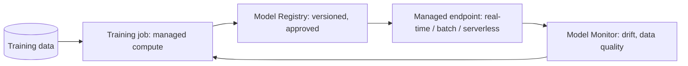
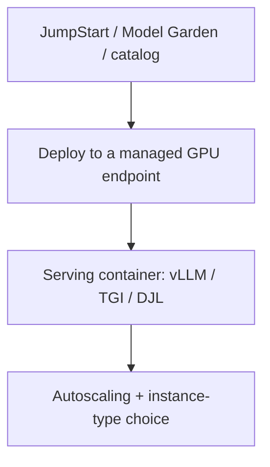

# Lesson 5 — Training & Hosting Your Own (SageMaker / Vertex)

> **One-liner:** When a managed model API isn't enough — you need custom/fine-tuned weights, a specific open model, private hosting, or a classical ML model — you drop to the **train-and-host** stack: SageMaker (AWS) or Vertex training/endpoints (GCP), with training jobs, a model registry, and managed inference endpoints.

---

## 🎯 TL;DR

The managed-API path (Lessons 2–4) treats the model as a black-box service. This lesson is the **escape hatch**: bring your own model, fine-tune it, register it, and host it on a managed endpoint you control — the same platforms, different surface. This is where **cloud AI platforms meet classical MLOps** ([`../02_mlops/`](../02_mlops/README.md)): training jobs, model registry, endpoints, and monitoring are the concrete cloud implementations of that lifecycle.

---

## 1. The train-and-host lifecycle

| Stage | SageMaker | Vertex AI |
|---|---|---|
| **Train** | Training Jobs (+ JumpStart FMs) | Custom Training / Tuning |
| **Register** | SageMaker Model Registry | Vertex Model Registry |
| **Serve** | Real-time / Serverless / Async / Batch endpoints | Vertex Endpoints (online) / Batch |
| **Monitor** | SageMaker Model Monitor | Vertex Model Monitoring |
| **Orchestrate** | SageMaker Pipelines | Vertex AI Pipelines |

---

## 2. When to leave the managed-API path

| Reason | Why the API won't do |
|---|---|
| **Custom / fine-tuned weights** | You need *your* model, not a catalog one |
| **Specific open model + control** | Pin a version, control quantization, custom serving |
| **Strict privacy / air-gap** | Weights + data must stay fully in your VPC |
| **Cost at steady high volume** | Fixed GPU endpoints beat per-token at scale |
| **Classical ML** | Tabular/vision/forecasting models aren't foundation-model APIs |

If none of these apply, **stay on the managed API** — self-hosting is real ops burden (GPU quotas, scaling, patching).

---

## 3. Hosting foundation / open models

- Both clouds offer 1-click deploy of popular open models (SageMaker **JumpStart**, Vertex **Model Garden**) onto managed GPU endpoints.
- Under the hood it's the inference stack from [`AI/04`](../../AI/04_llm-serving-and-inference-optimization/README.md) (vLLM/TGI, batching, quantization) — the platform manages the boxes; you choose instance type + autoscaling.
- Cost reality: a live GPU endpoint bills **while idle** — right-size, autoscale to zero where supported, or use serverless/batch for spiky loads (ties to [`../03_llmops/07`](../03_llmops/07-cost-and-performance-engineering.md)).

---

## 4. Registry + monitoring = the MLOps backbone

| Capability | Why it matters |
|---|---|
| **Model Registry** | Versioned, stage-gated (staging→prod), approval-tracked models — reproducibility + rollback |
| **Pipelines** | Repeatable train→eval→register→deploy, triggered on new data |
| **Model Monitor** | Data-quality + drift detection on the live endpoint → retrain trigger |

This is the concrete, cloud-native realization of the [`02_mlops`](../02_mlops/README.md) lifecycle — and the LLM-app monitoring in [`../03_llmops/06`](../03_llmops/06-monitoring-and-drift.md) is its foundation-model sibling.

---

## 5. Key terms

| Term | Meaning |
|------|---------|
| **Training job** | Managed, ephemeral compute that trains/tunes a model |
| **Model Registry** | Versioned catalog of trained models with stage gates |
| **Managed endpoint** | Cloud-hosted inference server you deploy a model to |
| **JumpStart / Model Garden** | 1-click deploy of foundation/open models |
| **Model Monitor** | Managed drift/data-quality monitoring on an endpoint |

---

## ✍️ Notes / follow-ups
- This is the bridge lesson: managed-API GenAI on one side, classical [`../02_mlops/`](../02_mlops/README.md) on the other.
- Fine-tuning technique itself lives in [`AI/02`](../../AI/02_fine-tuning-and-alignment/README.md) and [`../01_lora-qlora/`](../01_lora-qlora/README.md).
- Next: [Lesson 6 — Multi-Cloud, Portability & Cost](06-multi-cloud-portability-and-cost.md).
