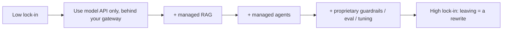
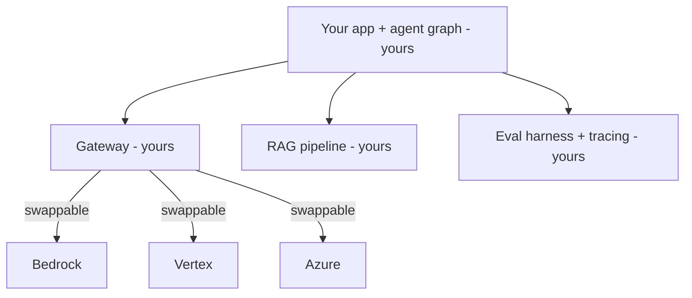

# Lesson 6 — Multi-Cloud, Portability & Cost

> **One-liner:** The deeper you adopt a platform's proprietary RAG/agent/guardrail features, the harder (and costlier) it is to leave — so decide *deliberately* what to hand to the platform and what to keep portable, and watch the cost traps (idle endpoints, egress, per-token creep) that don't show up in a demo.

---

## 🎯 TL;DR

Lock-in isn't binary — it's a dial. Using a platform's **model API** is easily portable (swap the backend behind your gateway); using its **managed RAG + agents + guardrails + eval** deeply is not (that's a rewrite to leave). The disciplined pattern: keep the **portability-critical, expensive-to-rebuild** pieces yours — the **gateway, RAG pipeline, evals, and tracing** — and treat the cloud platform as a **swappable model backend**. Then manage cost with the same rigor as [`../03_llmops/07`](../03_llmops/07-cost-and-performance-engineering.md), plus the cloud-specific traps.

---

## 1. The lock-in dial

| Layer | Portability | Keep it yours if… |
|---|---|---|
| **Model invocation** | 🟢 High (gateway swaps backend) | Always fine to use the platform here |
| **Managed RAG** | 🟡 Medium | You may outgrow chunking/reranking limits |
| **Agents / orchestration** | 🔴 Low | Your agent logic is core IP → own it (LangGraph) |
| **Evals / tracing** | 🔴 Low if platform-shaped | These must be portable to compare vendors at all |

---

## 2. The portability pattern

Own the **graph, gateway, RAG pipeline, evals, and traces**; rent the **model (and maybe guardrails)**. This is exactly the "assemble-your-own where it counts" stance from Lesson 1 — and it's what lets you run a real bake-off between platforms instead of guessing.

---

## 3. Do you actually need multi-cloud?

| Reason given | Verdict |
|---|---|
| "Avoid lock-in" | Partial — the *portability pattern* gets you 80% without running everything twice |
| "Best model per task" | Legit — route per task via the gateway (models differ by strength) |
| "Regulatory / customer requirement" | Legit — some contracts mandate a specific cloud |
| "Resilience to one provider's outage" | Legit but costly — real multi-cloud doubles ops |
| "It feels safer" | Usually not worth the 2× complexity — prefer portability over active multi-cloud |

Rule: **design for portability, deploy single-cloud**, until a concrete requirement forces true multi-cloud.

---

## 4. Cost traps the demo won't show

| Trap | Fix |
|---|---|
| **Idle GPU endpoints** (Lesson 5) | Autoscale-to-zero / serverless / batch for spiky loads |
| **Data egress** between clouds/regions | Keep compute next to data (data gravity, Lesson 1) |
| **Per-token creep** at scale | Cost-tiered routing + caching (gateway) + right-sizing ([`../03_llmops/07`](../03_llmops/07-cost-and-performance-engineering.md)) |
| **Managed-RAG re-embedding** on every re-ingest | Incremental/upsert ingestion ([data-eng L5](../../AI/20_data-engineering-for-rag/05-freshness-sync-and-quality.md)) |
| **Log/trace storage** growth | Sampling + retention policies (Lesson [`../03_llmops/05`](../03_llmops/05-observability-and-tracing.md)) |

---

## 5. Mini-project (make the choice concrete)

Write a one-page **platform decision record** for a hypothetical app:
1. State the constraints (current cloud, required models, residency).
2. Run the Lesson 1 decision framework → pick a platform.
3. Draw the portability line: what's yours vs the platform's.
4. Estimate monthly cost at an assumed request volume (tokens × price + any endpoint hours).
5. List the top 3 lock-in risks and your mitigation for each.

This is the artifact a staff-level engineer produces — and a great portfolio/interview piece.

---

## 6. Key terms

| Term | Meaning |
|------|---------|
| **Lock-in dial** | Lock-in as a spectrum set by how many proprietary features you adopt |
| **Portability pattern** | Own graph/gateway/RAG/evals/traces; rent the model |
| **Data egress** | Charges for moving data out of a cloud/region |
| **Autoscale-to-zero** | Scaling idle endpoints down so you don't pay for idle GPUs |
| **Decision record** | A short written justification of an architecture choice |

---

## ✍️ Notes / follow-ups
- Closes the module: you can now choose a platform (L1), use any of the three (L2–4), self-host when needed (L5), and stay in control of cost + lock-in (L6).
- Cost discipline continues in [`../03_llmops/07`](../03_llmops/07-cost-and-performance-engineering.md); the RAG pipeline you keep "yours" is the next module.
- Related: [Data Engineering for RAG](../../AI/20_data-engineering-for-rag/README.md).
