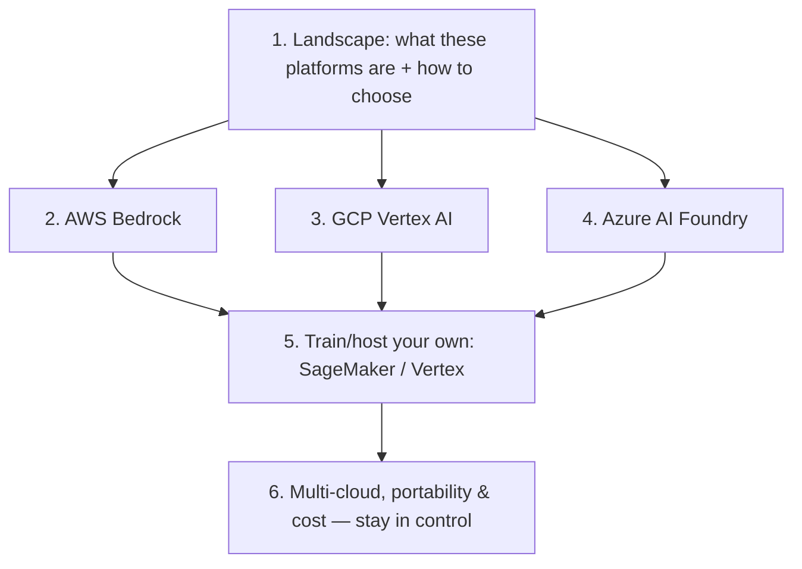

# ☁️ Cloud AI Platforms — Deep Dive

> The hands-on expansion of [`03_llmops/` Lesson 8](../03_llmops/08-cloud-ai-platforms-and-iac.md). That lesson was the one-page map; this module is the **field guide** — how each of the big three managed AI platforms actually works, what its RAG/agent/guardrail building blocks are called, how you invoke a model, and how to choose (and avoid getting locked into) one.
>
> Scope: the **managed foundation-model platforms** (AWS **Bedrock**, GCP **Vertex AI**, Azure **AI Foundry**) plus the **train/host-your-own** path (SageMaker / Vertex training). The classical model lifecycle behind that path lives in [`../02_mlops/`](../02_mlops/README.md); operating apps on top lives in [`../03_llmops/`](../03_llmops/README.md).

---

## Lessons

| # | Lesson | Theme | Status |
|---|--------|:------|:------:|
| 1 | [The Landscape & How to Choose](01-landscape-and-how-to-choose.md) | Decision framework | ✅ |
| 2 | [AWS Bedrock — Hands-On](02-aws-bedrock-hands-on.md) | AWS | ✅ |
| 3 | [GCP Vertex AI — Hands-On](03-gcp-vertex-ai-hands-on.md) | GCP | ✅ |
| 4 | [Azure AI Foundry — Hands-On](04-azure-ai-foundry-hands-on.md) | Azure | ✅ |
| 5 | [Training & Hosting Your Own (SageMaker / Vertex)](05-training-and-hosting-your-own.md) | Custom models | ✅ |
| 6 | [Multi-Cloud, Portability & Cost](06-multi-cloud-portability-and-cost.md) | Lock-in & $ | ✅ |

---

## The arc (how the lessons connect)

- **1** = the decision framework (read first).
- **2–4** = one hands-on page per platform, same shape so you can compare side by side.
- **5** = the escape hatch when managed model access isn't enough — bring/train your own.
- **6** = the meta-lesson: abstract the platform so cost and lock-in stay your choice.

---

## Core cheat-sheet

| Concept | In one line |
|---------|-------------|
| **Managed AI platform** | Cloud bundle: model access + managed RAG + agents + guardrails + eval + monitoring |
| **The "which cloud" rule** | Platform choice is usually decided by the cloud you're already on |
| **Bedrock** | AWS · Anthropic/Meta/Mistral/Amazon models · Knowledge Bases, Agents, Guardrails · `converse`/`invoke_model` |
| **Vertex AI** | GCP · Gemini + Model Garden · RAG Engine, Agent Builder/ADK, Vertex AI Search · tuning |
| **Azure AI Foundry** | Azure · Azure OpenAI + model catalog · prompt flow, content safety, Agent Service · *deployments* |
| **SageMaker / Vertex training** | Train/host **your own** weights: jobs, endpoints, model registry, monitoring |
| **Managed RAG** | Platform ingests your docs and does chunk→embed→index→retrieve for you (Bedrock KB, Vertex RAG Engine, Azure AI Search) |
| **Lock-in lever** | The deeper you use proprietary RAG/agent/guardrail features, the harder the exit |
| **Portability pattern** | Keep the gateway, evals, and tracing yours; treat the platform as a swappable model backend |

---

## How this connects to the rest of the repo

| Topic | Where |
|---|---|
| One-page cloud overview + IaC | [`../03_llmops/08`](../03_llmops/08-cloud-ai-platforms-and-iac.md) |
| Managed **guardrails** vs your own | [`../../AI/03_llm-security-and-guardrails/`](../../AI/03_llm-security-and-guardrails/README.md) |
| Managed **RAG** vs building your own pipeline | [`../../AI/12_rag/`](../../AI/12_rag/README.md), [`../../AI/06_vector-databases/`](../../AI/06_vector-databases/README.md), [`../20_... (data eng)`](../../AI/20_data-engineering-for-rag/README.md) |
| Managed **eval** vs your harness | [`../../AI/16_evals/`](../../AI/16_evals/README.md) |
| Classical model lifecycle behind SageMaker/Vertex training | [`../02_mlops/`](../02_mlops/README.md) |

---

## A note on sourcing

No single video source. Consistent with the repo's [`claude-code/`](../../AI/17_claude-code/README.md) and [`mlops/`](../02_mlops/README.md) notes, these pages are distilled from the official documentation of AWS Bedrock/SageMaker, Google Cloud Vertex AI, and Azure AI Foundry, plus established practice. Cloud APIs and product names change fast — treat CLI/SDK snippets as **illustrative shapes**, and confirm exact syntax against current docs before running.

---

## How each page is structured
- **TL;DR** — the one thing to remember.
- **Core concepts** — distilled, with tables and Mermaid diagrams.
- **Key terms** — quick glossary.
- **Notes** — cross-links to related lessons + pointer to what's next.
