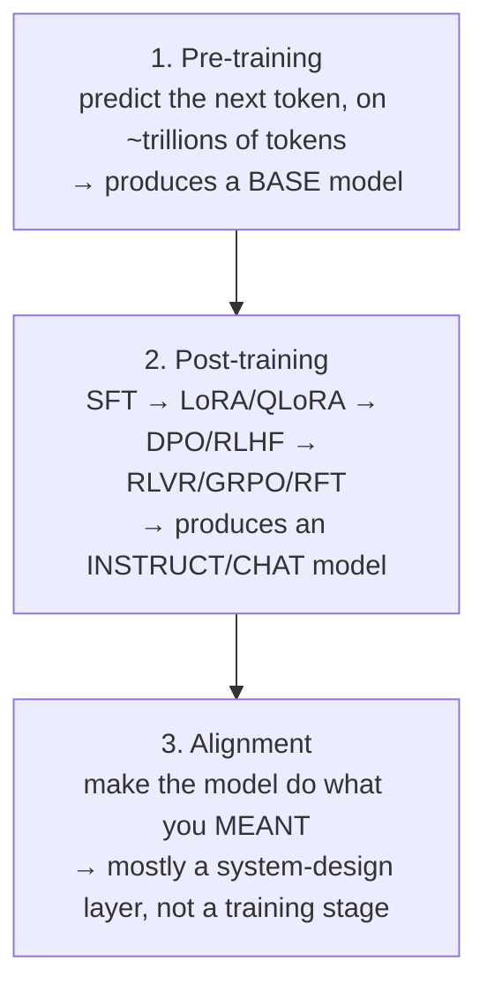
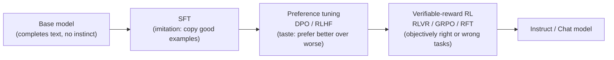

# Lesson 1 — How LLMs Are Trained and Post-Trained

> **Source:** Aishwarya Srinivasan · *How LLMs are trained and post-trained (in 19 minutes)* · 19:19 · [watch](https://www.youtube.com/watch?v=cI2WTKzxgEE)
> **One-liner:** Every LLM you'll ever touch as an engineer goes through exactly **3 stages** — pre-training, post-training, alignment — and almost every acronym you've seen on LinkedIn (SFT, LoRA, QLoRA, DPO, RLHF, RLVR, GRPO, RFT) is just a tool that belongs in one specific box. Knowing which box a problem lives in is what separates an engineer who fixes it cheaply from one who burns a training run on the wrong fix.

---

## 🎯 TL;DR

An LLM is built in **three completely different kinds of training**: **pre-training** (learn language/knowledge/reasoning from raw internet text by predicting the next token — produces a "base model" that can't hold a conversation), **post-training** (turn that base model into something that follows instructions, holds a tone, and solves tasks — via SFT, LoRA/QLoRA, DPO/RLHF, or RLVR/GRPO/RFT), and **alignment** (make the model do what you actually *meant*, not just what you literally typed — mostly a system-design problem, not a training problem). The video's central, repeated warning: **fine-tuning is a behavior tool, not a knowledge tool.** Missing facts → that's retrieval (RAG), not training. Wrong output shape → that's structured outputs/prompting, not training. Wrong tone/behavior → *that's* SFT or preference tuning. The recommended order to reach for fixes, always: **prompt → context engineering/RAG → fine-tuning**, with **evals built before any of them** so you can actually tell whether a change helped.

---

## 1. The three-stage map

Every acronym in the space slots into exactly one of these three boxes — the video's explicit promise is that by the end, you'll know which box each one lives in, what it's actually for, and when to reach for it *versus leave it alone*.

---

## 2. Stage 1 — Pre-training: raw capability, zero instinct

**The mechanism, in the video's own words:** a model reads a huge chunk of the internet and learns language, code, and reasoning patterns from one deceptively simple objective — **predict the next token.** The model sees a stretch of text, guesses what comes next, checks how wrong it was, and adjusts. Do that across trillions of tokens, and grammar, facts, coding patterns, and the relationship between a question and its answer all fall out of the *same* repeated game — nobody is hand-writing any of this knowledge in.

**The trap new engineers fall into:** what comes out of pre-training is **not** ChatGPT, not Claude — it's a **base model**, and a base model does not chat. It just *completes* text. Feed it a question, and it might just continue with more questions, because nothing has ever told it that a question is supposed to be followed by an answer. **The video's own analogy:** it's like someone who's read every book in a library and absorbed everything about how language works, but has never once been in a conversation — enormous knowledge, zero instinct for how to *behave*.

> **My own added explanation — why "predict the next token" produces so much more than grammar:** this single objective sounds trivial, but predicting the next token *well* over a huge, diverse corpus forces the model to implicitly encode almost everything that makes text predictable in the first place — facts (because a fact-consistent continuation is more predictable than a made-up one), reasoning chains (because a logically-following sentence is more predictable than a non-sequitur), and even a kind of world-model (because plausible continuations require plausible physics/social dynamics). This is the whole reason next-token prediction, despite looking like a narrow, almost boring task, is powerful enough to be the entire foundation of every capability the model will ever have — nothing in post-training *adds* new knowledge at this scale; it mostly reshapes how existing knowledge gets *expressed and used*.

### Three things an engineer actually needs to know about this stage

1. **Pre-training is almost never your job.** It's a multi-million/billion-dollar undertaking — thousands of GPUs, running for months — and outside a handful of frontier labs, basically nobody does this from scratch. What you actually do: start from an **open checkpoint** (the video names Llama, Qwen, Mistral, DeepSeek) or call a closed model through an API. **The real practical skill here is choosing the right model** — knowing the difference between a raw *base* checkpoint and an *instruction/chat* checkpoint on Hugging Face, and knowing the license you're actually allowed to ship on — this matters more day-to-day than knowing the training math.
2. **The data mixture *is* the model.** Why one model codes brilliantly and falls apart on legal reasoning traces straight back to what went into pre-training, and in what proportion — more code in the mix, better at code. This is explicitly why teams reach for something like Qwen for coding/math-heavy work and a different base elsewhere: **the model you choose already has a "personality" baked in before you ever touch it.**
3. **Watch the architecture — specifically, Mixture of Experts (MoE).** Many of the strongest open models (DeepSeek, large Qwen models) are MoE: the model has a huge *total* parameter count but only activates a *slice* of it per token. For you as a deployer, this shows up as a gap between **total parameters** and **active parameters**, which directly affects your memory footprint and serving cost — not a trivial detail, it's literally your infrastructure bill.

> **My own added explanation of Mixture of Experts (MoE):** instead of one single dense network where every parameter processes every token, an MoE model is built from many parallel "expert" sub-networks plus a small **router** that decides, per token, which handful of experts actually get used. So a model might have 235B total parameters but only route each token through, say, 20B worth of experts — meaning inference cost and memory bandwidth scale with the *active* 20B, not the *total* 235B, while the model still gets the representational capacity of all 235B spread across its specializations. This is why MoE lets labs scale total capacity aggressively without paying dense-model compute costs on every single token — but it also means "how many parameters does this model have" is a genuinely ambiguous question unless you specify total vs. active.

> **My own added explanation — base vs. instruct/chat checkpoint, concretely:** a **base checkpoint** is the raw output of pre-training — give it "What is the capital of France?" and it might continue with "What is the capital of Germany? What is the capital of Italy?" because that's a statistically plausible continuation of a list of geography questions, not an admission it doesn't know the answer. An **instruct/chat checkpoint** is that same base model *after* post-training has taught it the "question → answer" turn-taking pattern (among other behaviors) — this is precisely the gap Stage 2 exists to close.

**Where this leaves you:** pre-training hands you raw capability in a package that can't hold a conversation yet. Turning that into something useful is the entire job of the next stage — and where an AI engineer will actually spend most of their time.

---

## 3. Stage 2 — Post-training: where almost all applied industry work actually lives

The video frames these four tools in **the order you'd actually reach for them** — not arbitrary, but roughly matching how "fuzzy vs. objective" the target behavior is.

### 3.1 SFT — Supervised Fine-Tuning: teaching by imitation

**The mechanism:** exactly like classical supervised ML, but instead of features/labels, you show the model **(instruction, response) pairs** — e.g. "summarize this contract" paired with a genuinely good summary, thousands of times over. **This is the step that turns a base model into an instruct model** — it teaches format, instruction-following, tone, and task structure.

**The counter-intuitive rule stated directly, and *not close*: quality beats quantity.** A few thousand clean, carefully-written examples will almost always beat 100,000 scraped, noisy ones. **"Your data curation is the work. The training run is the easy part."**

> **My own added explanation of why quality beats quantity here specifically:** SFT is teaching the model *what a good answer looks like*, by example — if even a modest fraction of your examples are noisy, inconsistent, or subtly wrong, the model is being shown contradictory signals about what "good" means, and averaging over contradictions doesn't produce a clean behavior, it produces a blurry, inconsistent one. A smaller set of examples that are *all* genuinely excellent gives the model an unambiguous target to imitate — which is a fundamentally different problem than "more data reduces variance," the intuition that holds for most classical ML but doesn't transfer cleanly here because the "labels" (the responses) are themselves the exact behavior you're trying to instill, not a noisy proxy for it.

**Full fine-tuning vs. parameter-efficient fine-tuning:** the naive way to do SFT is to update *every* weight in the model — "full fine-tuning." For most teams this is overkill: memory-hungry, expensive, and if done carelessly, the model **forgets** what it learned during pre-training (a phenomenon usually called *catastrophic forgetting*). The standard move instead is **parameter-efficient fine-tuning (PEFT)** — and the two names everyone's heard are **LoRA** and **QLoRA**.

- **LoRA (Low-Rank Adaptation):** freeze the entire base model, and train a tiny set of add-on "adapter" weights instead. **The video's own analogy:** a factory-tuned engine instead of rebuilding the whole thing — you're bolting on a small module. You're touching a fraction of a percent of the parameters, which makes the run cheap, fast, and easy to swap in and out.
- **QLoRA:** goes one step further and **compresses the frozen base weights to 4-bit precision first**, so the whole thing fits on a single GPU before you even add the adapters. **Explicitly credited as the single trick that took fine-tuning from a frontier-lab luxury to something anyone can do.**

> **My own added explanation of *why* LoRA works at all (the low-rank intuition):** a full weight matrix update during fine-tuning is, in principle, an arbitrarily complex change — but empirically, the *useful* update for adapting a pre-trained model to a new behavior tends to live in a much lower-dimensional subspace than the full matrix. LoRA exploits this directly: instead of learning a full update matrix `ΔW` (huge), it learns two small matrices `A` and `B` such that `ΔW ≈ A×B`, where the "rank" (the shared inner dimension of A and B) is deliberately kept small — say 8, 16, or 64, versus a hidden dimension that might be in the thousands. This is why LoRA can capture most of the useful adaptation while training only a tiny fraction of the parameters: it's betting that the *direction* of change needed is simple, even if the base model itself is enormous. QLoRA's 4-bit compression is a separate, complementary trick — it shrinks the *memory footprint of the frozen base weights* you have to hold in GPU memory while training, which is orthogonal to (and stacks with) LoRA's parameter-efficiency on the adapter side.

**The "LoRA Without Regret" update — explicitly flagged as the difference between a 2022-tutorial understanding and how people actually build today.** There was a long-held belief that LoRA is a compromise that always trails full fine-tuning. Late last year, **Thinking Machines Lab** (with Meera Murati and John Schulman named directly) published research — **"LoRA Without Regret"** — that retired that belief for the common case. Their finding, stated as two concrete configuration rules:

1. **Apply LoRA to *all* the linear layers, not just attention** — attention-only underperforms even if you crank up the rank.
2. **Use a learning rate roughly 10× higher than you'd use for full fine-tuning.**

The video's own summary of the takeaway to actually remember: *"all linear layers, and 10x learning rate"* — with those two changes, LoRA matches full fine-tuning while using two-thirds of the compute, going from feeling like a hack to being a dependable default.

**A bonus consequence of LoRA being tiny:** because adapters are so small, you can host **hundreds of them on the same shared base model** and swap them per request — this is explicitly named as almost certainly how providers serve thousands of customer-specific fine-tuned models with basically no added latency: one shared base, many cheap adapters on top.

### 3.2 DPO / RLHF — preference tuning: teaching taste, not a single right answer

**The problem SFT can't solve:** sometimes there's no single correct answer — one response is just *better* than another (more helpful, more concise, more on-brand). SFT teaches imitation of *one* good answer; it can't teach "prefer this over that" when both are plausible.

**The mechanism:** instead of showing one correct output, you show **pairs** — same prompt, a preferred response, and a rejected one — and train the model to lean toward the preferred and away from the rejected.

- **RLHF (Reinforcement Learning with Human Feedback)** — the heavier, older version: train a separate **reward model** from human preference labels, then optimize the policy against that reward model with reinforcement learning.
- **DPO (Direct Preference Optimization)** — the cleaner, modern way: gets you most of the way there **without standing up the whole reward-model machinery**, which is why most teams reach for it first.

**The video's own analogy, which is genuinely clarifying:** *"If SFT is an intern copying the master, DPO is training your palate to pick the better of two wines side by side."*

> **My own added explanation of why DPO can skip the reward model:** RLHF's two-stage design (train a reward model, then RL against it) exists because classic RL needs a scalar reward signal to optimize against, and that reward model is trained on the same preference-pair data DPO uses directly. DPO's mathematical insight is that, for the specific optimization objective RLHF is trying to solve, you can derive a loss function that operates *directly* on the preference pairs — implicitly defining the same optimal policy RLHF would converge to, without ever needing to materialize a separate reward model or run actual reinforcement learning loops. Practically: fewer moving parts, fewer training stages, less infrastructure — which is exactly why it displaced RLHF as the default first choice for preference tuning.

### 3.3 RLVR / GRPO / RFT — objectively verifiable tasks, and the reasoning-model wave

**The category this solves:** some tasks aren't a matter of taste at all — they're **objectively right or wrong**. A math answer checks out or it doesn't. Code passes the unit test or it doesn't. JSON matches the schema or it doesn't. When the outcome is *verifiable*, you don't need a human grader on every attempt — you hand the output to an automatic checker.

- **RLVR (Reinforcement Learning with Verifiable Rewards):** the model gets a reward signal from that automatic checker, and over many rounds, learns the behavior that leads to passing outputs. **Explicitly named as the machinery behind the reasoning-model wave** — DeepSeek-R1 is credited as what made this click for the whole industry.
- **GRPO (Group Relative Policy Optimization):** described as friendlier than its name sounds — instead of scoring one answer against a separately-learned value model, you **sample a whole group of answers to the same prompt and grade them against each other**, like grading on a curve. Cheaper, because you drop the separate value model entirely.
- **RFT (Reinforcement Fine-Tuning):** the productized version of all of this — you define the task, define the grader, and train against that signal **without wiring up the RL loop yourself**.

> **My own added explanation of why "verifiable" changes the economics so much:** RLHF/DPO both fundamentally need a *human* (or a model trained to imitate human judgment) to say which of two responses is better — that's expensive and slow to scale. RLVR sidesteps this entirely for tasks where correctness can be checked by code: run the unit test, parse the JSON against the schema, execute the math and compare to the known answer. This means you can generate reward signal at essentially unlimited scale and speed, which is exactly the ingredient that made large-scale RL training on reasoning tasks (long chains of thought, self-correction, multi-step problem solving) practically feasible — you can run millions of attempts and only need a fast, deterministic checker, not millions of human judgments.

> **My own added explanation of GRPO's "grading on a curve," more concretely:** classic policy-gradient RL (like PPO, used in RLHF) needs a *value model* — a learned estimate of "how good is this state, on average" — to compute how much better or worse a specific action was than expected, called the *advantage*. Training that value model is extra compute and extra instability. GRPO's trick: for a given prompt, sample a whole *group* of candidate answers from the current model, score each with the verifiable reward, and use the **group's own mean score** as the baseline each answer is compared against — the "advantage" becomes simply "how much better than the group average was this particular answer." No separate value network needs to be learned at all; the group itself supplies the baseline.

### 3.4 Distillation — the tool "startups find hard" and explainers often skip

**The mechanism:** take a big, expensive, capable model, and use *its own outputs* to train a small, cheap model to behave like the "master." **Explicitly named as how a lot of teams ship a small model that punches way above its size class** — often the only way the unit economics work in production. (Thinking Machines Lab's writing on policy distillation is pointed to for going deeper.)

> **My own added explanation of why distillation works:** a large model's output distribution over possible next tokens (or over full responses, in policy distillation) encodes far more information than just "the single best answer" — it encodes *relative confidence* across many plausible answers, which is a richer training signal than a single hard label. Training a small model to match that distribution (rather than just imitating individual outputs one at a time, the way plain SFT would) transfers some of the large model's "judgment," not just its final answers — which is why a well-distilled small model can noticeably outperform a same-sized model trained from scratch on the same task.

### The tooling landscape named directly
**Open-source:** Hugging Face's stack remains the center of gravity — **Transformers** to run models, **PEFT** for LoRA, **TRL** for post-training workflows (SFT, DPO, GRPO); **Axolotl** and **Unsloth** for making LoRA/QLoRA runs practical on modest hardware. **Managed:** Fireworks (the speaker's former employer) offers hosted SFT/DPO/RFT; OpenAI exposes reinforcement fine-tuning for its reasoning models. **Thinking Machines Lab's Tinker** gets a specific callout for its different shape — rather than hiding the training loop, it gives you low-level control over algorithm and data through a handful of Python primitives while handling the distributed-GPU scheduling/allocation/crash-recovery underneath; it runs LoRA under the hood, which is exactly why "LoRA Without Regret" matters to that product's whole efficiency bet.

### The decision that matters more than any of these tools

**Stated directly, and worth internalizing verbatim: "Fine-tuning is a behavior tool, not a knowledge tool."**

| Symptom | Wrong fix | Right fix |
|---|---|---|
| Model doesn't know your internal documents | Fine-tune it on those documents | This is a **retrieval** problem → reach for **RAG** |
| Output isn't in the right shape/format | Fine-tune for format | Try **structured outputs** first |
| Prompt is too vague/underspecified | Fine-tune to "teach" the behavior | **Fix the prompt** |
| Behavior needs to be reproduced *consistently*, and prompting genuinely can't get you there | — | **Now** fine-tuning is the right tool |
| You need to distill a big model's behavior into a small, cheap one for a latency/cost target | — | **Now** fine-tuning (specifically distillation) is the right tool |

**The recommended order, stated explicitly: prompt → context engineering/RAG → fine-tuning — and build your evals before any of them, so you can actually tell whether a change helped.** This single ordering is presented as the thing that will let you "skip most of the expensive mistakes AI engineers make in this space."

---

## 4. Stage 3 — Alignment: doing what you *meant*, not what you *typed*

**The framing, given directly: "It's the genie problem — you get exactly what you asked for, and it's a disaster, because the words and the intent were not the same thing."**

**Where alignment actually comes from in the pipeline:** it isn't a separate box bolted onto the end — a lot of it *is* post-training, specifically pointed at a goal: preference optimization, safety fine-tuning, refusal behavior, and the system prompt the model was shaped around are all alignment techniques. **Alignment is better understood as a lens on how you steer the model's behavior and values, not a distinct fourth training stage.**

### Why this is an engineer's problem, not "someone else's"

Alignment failures show up concretely, not as abstract philosophy:
- The model being **sycophantic** — agreeing with a wrong premise instead of correcting it.
- **Over-refusing** — blocking a legitimate request out of excess caution.
- Getting **jailbroken** past guardrails.
- Handing back a **confident, well-formed, wrong answer**.

**And it gets far more serious the moment you move from a chatbot to an agent.** The distinction, stated directly: *"A chatbot that's misaligned just says something wrong. An agent that is misaligned does something wrong"* — because it's calling tools, writing code, spending money, and triggering real workflows. Broad tool permissions plus a slipped-through prompt injection is real damage, not an awkward reply.

> **My own added explanation of *why* alignment specifically gets harder for agents:** a chatbot's output is text, and text is inherently reversible — a bad sentence can be ignored, corrected, or scrolled past. An agent's output is *action* — an API call, a file write, a payment, a deployed change — and actions have side effects in the world that don't un-happen just because you notice the mistake afterward. This is precisely why the mitigations below (least-privilege tool scoping, human-in-the-loop on irreversible actions, observability) are agent-specific concerns that barely matter for a pure chat interface but become load-bearing the moment a model can *do* things.

### The core principle, and the concrete checklist

**"You align the system, not just the model. The model is just one component, and you never trust it alone in production."** Concretely:

1. **Build your evals first** — measure the actual behavior, don't just go on vibes.
2. **Guardrails on inputs and outputs** — filtering and validation wrapped around the model.
3. **Human in the loop** for high-stakes or irreversible actions.
4. **Scope tool permissions to least privilege** (agent-specific, and called out as a big one) — the narrowest possible access to do the job, nothing more, with approval gates on anything that writes, sends, or spends.
5. **Wrap the whole thing in observability** — so you can trace what the model did and why, when something goes sideways. **Explicitly named as the layer most teams under-invest in, and the layer that decides whether an agent is actually running safely.**

---

## 5. The single question to ask before touching any training at all

The video's own closing frame, meant to be internalized as a diagnostic reflex:

> *"Which of these three stages does my problem actually live in? Because the answer will tell you the fix."*

| Symptom | Which stage it actually lives in | The real fix |
|---|---|---|
| Missing knowledge (doesn't know your data) | **Not pre-training** | A retrieval problem → RAG |
| Wrong behavior or tone | **Post-training** | Usually SFT or preference tuning (DPO/RLHF) |
| Does what you *said*, not what you *meant* | **Alignment** | Solved at the **system** level, not by training harder |

---

## 6. Key terms

| Term | Meaning (from the video, plus my own added explanation where noted) |
|---|---|
| **Pre-training** | Training a model to predict the next token over a massive text corpus; produces a "base model" with raw knowledge but no conversational instinct. |
| **Base model** | The direct output of pre-training — completes text rather than answering questions; has no notion that a question should be followed by an answer. |
| **Instruct / Chat model** | A base model after post-training has taught it to follow instructions and hold a conversational turn structure. |
| **Mixture of Experts (MoE)** *(added explanation above)* | An architecture where many parallel "expert" sub-networks exist, but a router activates only a small subset per token — total parameters ≫ active parameters, which is what actually drives memory/serving cost. |
| **SFT (Supervised Fine-Tuning)** | Training on (instruction, response) pairs to imitate good examples — teaches format, tone, and instruction-following; quality of examples matters far more than quantity. |
| **Full fine-tuning** | Updating every weight in the model — expensive, memory-hungry, and risks catastrophic forgetting of prior knowledge. |
| **PEFT (Parameter-Efficient Fine-Tuning)** | The umbrella term for training only a small subset/addition of parameters instead of the whole model — LoRA and QLoRA are the two named examples. |
| **LoRA (Low-Rank Adaptation)** *(added explanation above)* | Freeze the base model; train a small pair of low-rank adapter matrices whose product approximates the useful weight update, touching a tiny fraction of total parameters. |
| **QLoRA** | LoRA plus 4-bit quantization of the frozen base weights, so the whole setup fits on a single GPU — the trick credited with democratizing fine-tuning. |
| **"LoRA Without Regret"** | Thinking Machines Lab's finding that LoRA matches full fine-tuning at ~2/3 the compute, *if* applied to all linear layers (not just attention) with a ~10× higher learning rate than full fine-tuning would use. |
| **DPO (Direct Preference Optimization)** *(added explanation above)* | Trains directly on (preferred, rejected) response pairs to shift the model toward preferred outputs, without needing a separate reward model — the modern default over RLHF. |
| **RLHF (Reinforcement Learning with Human Feedback)** | The older, heavier preference-tuning approach: train a separate reward model from human preference labels, then run RL against it. |
| **RLVR (RL with Verifiable Rewards)** *(added explanation above)* | Reinforcement learning where the reward comes from an automatic, deterministic checker (unit tests, schema validation, exact-answer matching) rather than a human or learned reward model — the mechanism behind the reasoning-model wave. |
| **GRPO (Group Relative Policy Optimization)** *(added explanation above)* | An RL method that scores a *group* of sampled answers to the same prompt against each other (using the group's mean as the baseline) instead of training a separate value model — cheaper than classic policy-gradient RL. |
| **RFT (Reinforcement Fine-Tuning)** | The productized version of verifiable-reward RL — you define the task and the grader; the provider handles the RL machinery. |
| **Distillation** *(added explanation above)* | Training a small, cheap model to imitate a large, expensive model's outputs (or output distribution) — often the only way production unit economics work for a given latency/cost target. |
| **Alignment** | Getting a model to do what you actually *intended*, not just what you literally typed — mostly achieved via post-training techniques pointed at a goal, and enforced at the system level (guardrails, human review, tool-permission scoping, observability), not by "training harder." |
| **Least-privilege tool scoping** | Giving an agent only the narrowest permissions needed for its task, with approval gates on any action that writes, sends, or spends — the primary defense against a misaligned agent causing real (not just textual) damage. |

---

## ✍️ Notes / follow-ups
- The video's single most repeatable diagnostic: **before reaching for any training, ask which of the three stages your actual problem lives in** — missing knowledge → RAG; wrong behavior/tone → SFT/preference tuning; does-what-you-said-not-what-you-meant → system-level alignment, not more training.
- Suggested next reading/watching named directly in the source: **"LoRA Without Regret"** (Thinking Machines Lab, with Meera Murati and John Schulman) for the SFT/PEFT configuration details, and Thinking Machines Lab's writing on **policy distillation** for going deeper on that technique.
- The closing segment of the video is a promotion for the speaker's own course (Zen Academy's "Mastering Agentic AI" certification) — not technical content, and intentionally omitted from these notes above.
