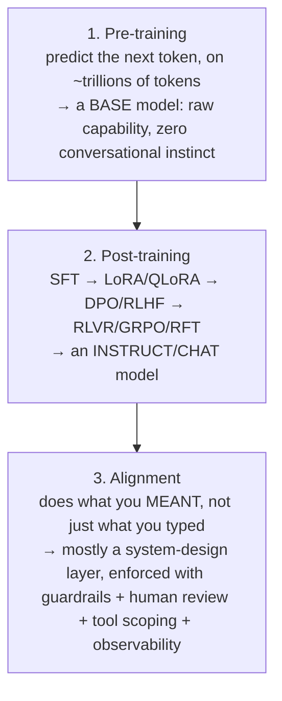

# 🏗️ LLM Training Pipeline — Pre-training, Post-training, Alignment

> The **engineer's map of how an LLM actually gets made**, before it ever shows up behind an API or inside your application. Every fine-tuning acronym you've seen on LinkedIn (SFT, LoRA, QLoRA, DPO, RLHF, RLVR, GRPO, RFT) slots into exactly one of **three stages** — this module is that map, plus the single diagnostic question that tells you which stage your actual problem lives in before you ever touch a training run.
>
> Scope: **why** each stage exists and **what it's for**, not how to write the training code yourself. This is the conceptual prerequisite for [`01_lora-qlora/`](../01_lora-qlora/README.md) (the hands-on LoRA/QLoRA project) and for deciding, on any real project, whether the fix is a prompt change, a RAG pipeline, or an actual fine-tuning run.

---

## Lessons

| # | Lesson | Theme | Status |
|---|--------|:------|:------:|
| 1 | [Pre-training, Post-training & Alignment](01-pretraining-post-training-alignment.md) | The 3-stage map + every major acronym placed on it | ✅ |

---

## The core map

- **Pre-training** — almost never your job. The practical skill is *choosing* the right open checkpoint or API model, understanding that the data mixture already gives it a "personality," and knowing whether it's a dense or Mixture-of-Experts architecture (which directly sets your serving cost).
- **Post-training** — where almost all applied industry work actually happens. SFT teaches imitation; LoRA/QLoRA make that cheap; DPO/RLHF teach *preference* when there's no single right answer; RLVR/GRPO/RFT exploit *verifiable* correctness (math, code, schema-matching) to scale reward signal without a human in the loop — this is the machinery behind the reasoning-model wave.
- **Alignment** — not a fourth training stage bolted on the end, but a lens on steering behavior/values, mostly achieved *through* post-training and enforced at the **system** level: evals first, guardrails on input/output, human-in-the-loop for high-stakes actions, least-privilege tool scoping for agents, and observability so failures are traceable.

---

## The one question that matters more than any tool in this module

> *"Which of these three stages does my problem actually live in?"*

| Symptom | Stage it actually lives in | The real fix |
|---|---|---|
| Model doesn't know your internal documents | **Not pre-training or post-training at all** | A retrieval problem → RAG |
| Output isn't in the right shape/format | **Not training** | Structured outputs, or fix the prompt |
| Wrong behavior or tone | **Post-training** | Usually SFT or preference tuning (DPO/RLHF) |
| Needs a behavior reproduced *consistently* and prompting can't get there | **Post-training** | Fine-tuning is now the right tool |
| Does what you *said*, not what you *meant* | **Alignment** | Solved at the **system** level — not by training harder |

**The recommended order to reach for fixes, stated directly in the source video: prompt → context engineering/RAG → fine-tuning — with your evals built *before* any of them**, so you can actually tell whether a change helped.

---

## Core cheat-sheet

| Term | In one line |
|---|---|
| **Base model** | Completes text; has no instinct that a question should be followed by an answer |
| **Instruct/chat model** | A base model after post-training has taught it conversational turn-taking and instruction-following |
| **SFT** | Imitation learning on (instruction, good-response) pairs — quality of examples beats quantity, not close |
| **LoRA / QLoRA** | Freeze the base model, train tiny low-rank adapter weights instead (LoRA); QLoRA adds 4-bit quantization so it fits on one GPU |
| **DPO / RLHF** | Teach *preference* from (preferred, rejected) response pairs — DPO skips RLHF's separate reward-model stage |
| **RLVR / GRPO / RFT** | Reinforcement learning where reward comes from an automatic checker (math/code/schema) instead of a human — the reasoning-model wave's engine |
| **Distillation** | Train a small, cheap model to imitate a large, expensive one — often the only way production unit economics work |
| **Alignment** | Doing what you *meant*; enforced via guardrails, human review, least-privilege tool scoping, and observability — not a training stage by itself |

---

## How this connects to the rest of the repo

| Topic | Where |
|---|---|
| Hands-on LoRA/QLoRA project (the "how" behind this module's "why") | [`../01_lora-qlora/`](../01_lora-qlora/README.md) |
| Serving/operating the resulting model in production | [`../03_llmops/`](../03_llmops/README.md) |
| Evaluating whether a fine-tune / prompt change actually helped | [`../../AI/16_evals/`](../../AI/16_evals/README.md) |
| Agent tool-permission scoping and guardrails in more depth | [`../../AI/03_llm-security-and-guardrails/`](../../AI/03_llm-security-and-guardrails/README.md) |

---

## A note on sourcing

Unlike this repo's other `Shared/` modules (which distill multiple sources or official docs), this module is distilled from **one specific video**: Aishwarya Srinivasan's *"How LLMs are trained and post-trained (in 19 minutes)"* ([watch](https://www.youtube.com/watch?v=cI2WTKzxgEE)). The lesson note is built from the video's full transcript, not just its description — including verbatim quotes for the sharpest lines, plus clearly-marked "my own added explanation" call-outs anywhere the note goes deeper than the video itself did (e.g. *why* LoRA's low-rank trick works, *why* GRPO can drop the value model). The video's closing course-promotion segment is intentionally omitted.

---

## How the lesson page is structured
- **TL;DR** — the one thing to remember.
- **The 3-stage map** — Mermaid diagram + how each stage feeds the next.
- **Deep dive per stage** — real quotes and analogies from the source, plus tables and added explanations for every acronym.
- **Key terms** — glossary, marked where an explanation was added beyond the source.
- **Notes** — the single diagnostic question to ask before any training, plus further-reading pointers named directly in the video.
